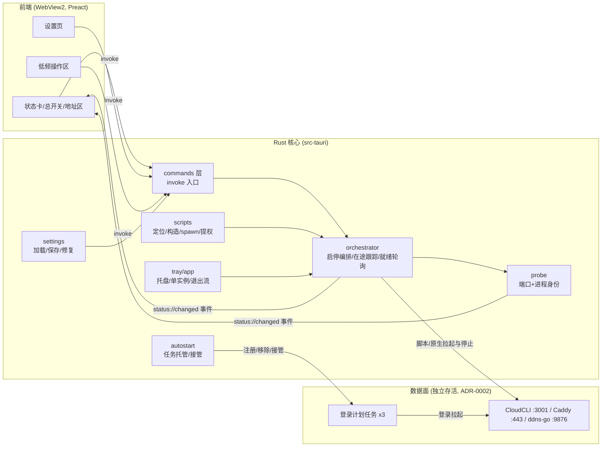
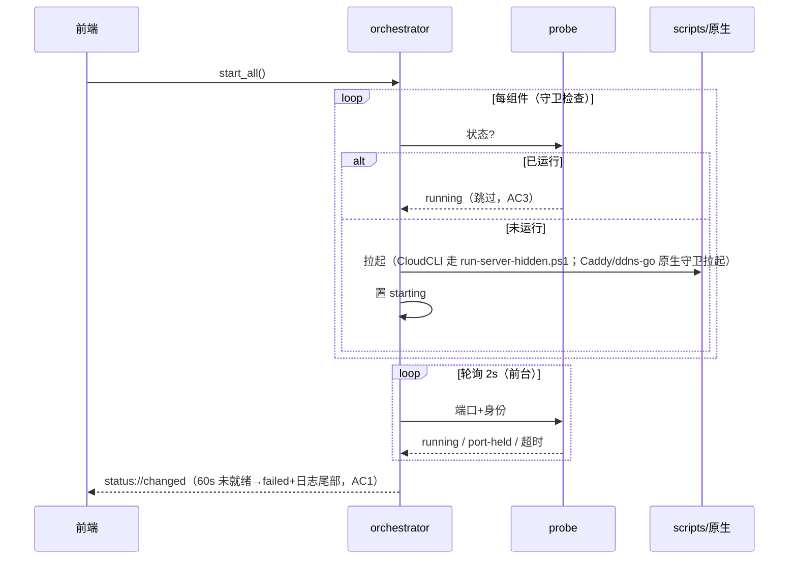

# 001-desktop-console · 技术方案（plan）

> 导航：[spec.md](./spec.md) · [tasks.md](./tasks.md) · 返回 [MOC](../MOC.md)

- **状态**: draft <!-- draft | reviewed -->
- **关联需求**: [spec.md](./spec.md)
- **最后更新**: 2026-09-08

## 1. 方案概述

Tauri 2 桌面程序：Rust 侧承载全部平台逻辑（设置存取、端口+进程身份探测、脚本编排、停止管线、自启托管），前端只是 Vite + TypeScript + Preact 的轻量视图层，经 `invoke` 调命令、经事件收状态。架构遵循 [ADR-0002](../../docs/adr/0002-control-data-plane-split.md)：三组件经登录计划任务常驻、独立于程序存活，程序是控制面——因此组件进程**不挂** kill-on-close Job，程序退出/崩溃不带走服务。sprint0 脚本按 spec §4.1 复用清单调用（启动走脚本、停止走程序内等效实现），密钥零接触。

## 2. 技术选型

| 领域 | 选型 | 理由 | 放弃的备选及原因 |
|------|------|------|------------------|
| 桌面框架 | Tauri 2 | 六项硬性能力官方一等支持；实测 8.6MiB；AI 语料充足 | Electron（重）、WPF（Plan B，见 ADR-0001） |
| 前端 | Vite + TypeScript + Preact + 手写 CSS | 4KB 运行时守住内存红线；蓝白主题手写最省 | React/Vue 全家桶、UI 组件库（违反轻依赖红线） |
| 前端 i18n | 自研轻量词典（zh/en 两个词条文件 + `t()` helper，与 sprint0 脚本 `T()` 同构）；Rust 侧原生文案（托盘菜单等）同一套词条源 | 零依赖守住轻量红线；双语词条集中可审；`auto` 判定为纯函数（系统显示语言 zh→zh 否则 en，与 `Get-UICulture` 同语义）可单测 | i18next 等框架（远超需求，违背轻依赖） |
| 端口/进程探测 | Rust 原生：`netstat2`（GetExtendedTcpTable）+ `sysinfo`（PID→exe 路径） | 2s 轮询不能承受 PowerShell 启动开销；纯 Rust 可 mock 可单测 | Get-NetTCPConnection 脚本轮询（每次 ~0.5s+）；劣化预案：`windows` crate 直调 IPHlpApi |
| 设置存储 | `%APPDATA%\ai-remote-workbench\settings.json`，serde，带 `version` 字段 | 纯文本可排障、可单测损坏恢复 | 注册表（diff 不友好）、前端 localStorage（不可靠、Rust 侧拿不到） |
| 脚本执行 | `std::process::Command` + `CREATE_NO_WINDOW(0x08000000)` + stdio 重定向到日志文件 | ADR-0001 落地约定（避免 conhost 闪烁/句柄悬挂） | `-WindowStyle Hidden`（conhost 先分配后隐藏） |
| UAC 提权 | `windows` crate 直调 `ShellExecuteW(verb="runas")`，可见窗口 | 标准机制；与 Job/探测共享 windows 依赖 | 已归档的 `runas` crate（ADR-0001） |
| 自启通道 | 登录计划任务：服务三任务复用 `setup-autostart.ps1`；程序自身任务用 PowerShell `Register-ScheduledTask`（`--hidden` 参数、ExecutionTimeLimit Zero） | ADR-0002：与 sprint0 机制同构可无缝接管；规避 Run 键静默禁用 | `tauri-plugin-autostart`（走 Run 键） |
| 局域网 IP | UDP connect 默认路由技巧（零依赖 ~10 行） | 展示主 IP 够用；全量 IP 已在 `%TEMP%\cloudcli.log` | `local-ip-address` crate（多余依赖）、复用 ps1（轮询开销） |
| 日志 | `tauri-plugin-log`，文件落 `%APPDATA%\ai-remote-workbench\logs\` | 官方、可从设置页打开目录 | 自研 append（无必要） |
| 打包/分发 | Tauri bundler：NSIS（**embedBootstrapper**，+1.8MB）+ **便携 zip** 双形态；`scripts/build.ps1` 一键产出（同步脚本副本 → 版本对齐校验 → 构建 → 产物命名 `<app>_<版本>_<arch>`） | 离线可装；"双击安装"与"拷包即用"两类分发场景都覆盖；构建可重复 | downloadBootstrapper（装时依赖网络）；仅单形态（分发场景受限） |

全局性选型已立 ADR：[0001-tauri2-desktop-stack](../../docs/adr/0001-tauri2-desktop-stack.md)、[0002-control-data-plane-split](../../docs/adr/0002-control-data-plane-split.md)。

## 3. 架构设计

### 3.1 模块划分与数据流



- `src/`（前端）+ `src-tauri/`（Rust）置于仓库根，与 CLAUDE.md 目录树兼容（T4 回填描述）。
- `src-tauri/resources/bin/`：打包内置的 sprint0 `bin\` 脚本副本；运行时查找顺序：设置覆盖目录 → 内置副本（开发模式直接指向仓库 `tools/sprint0/bin`）。

### 3.2 关键时序

一键启动（AC1/3/6）：



收摊退出（AC14）：托盘「停止服务并退出」→ 取消/等待在途启动 → 三组件并行执行停止管线（单组件 10s、总超时 30s，超时记日志放行）→ `app.exit()`。普通退出（AC13）直接 `app.exit()`。退出钩子挂 `RunEvent::ExitRequested`，不依赖窗口关闭事件（ADR-0001 踩坑清单）。

登录联动（AC11）：程序被计划任务以 `--hidden` 拉起 → 托盘常驻不弹窗 → 按 `linkStartServices` 决定是否 `start_all()`（不自动开浏览器）。

停止管线（AC2、§4.4）：CloudCLI＝定位 3001 监听 PID（身份校验）→ `taskkill /T`（先收集树再杀）→ 端口复核；Caddy＝`caddy stop`（5s 超时）→ 失败按 443 找监听进程并校验可执行路径后强杀 → 复核；ddns-go＝按可执行路径匹配进程（非进程名）→ 强杀 → 复核。

## 4. 数据模型

`settings.json`（`version: 1`；损坏时改名 `.bad-<时间戳>` 留档并回退默认，AC24）：

```json
{
  "version": 1,
  "language": "auto",            // auto | zh | en；auto = 系统显示语言 zh→中文、否则英文；显式选择优先于系统
  "autostartServices": true,     // AC8/9：服务三任务托管
  "autostartApp": false,         // AC10：程序自身登录任务
  "linkStartServices": true,     // AC11/12：启动时联动补齐
  "exitAction": "keep",          // keep | stop（AC13-15）
  "openPageOnStart": false,
  "scriptsDirOverride": null     // string | null：脚本目录覆盖（默认内置副本）
}
```

组件状态（事件载荷）：

```ts
type ComponentId = "cloudcli" | "caddy" | "ddnsgo";
type ComponentState = "stopped" | "starting" | "running" | "port-held" | "failed";
interface ComponentStatus { id: ComponentId; state: ComponentState; port: number;
                            detail?: string; since: number }  // since: 进入该状态的时间戳
```

端口/路径/域名为编译期常量（实例默认值，spec §5），不进设置文件（决策 6）。

## 5. 接口契约

### 5.1 Tauri commands（前端 ↔ Rust）

| 命令 | 签名要点 | 对应 AC |
|------|----------|---------|
| `get_status` | `-> ComponentStatus[]` | AC4 |
| `get_urls` | `-> { local, lan, domain }` | AC19（地址区） |
| `start_all` / `stop_all` | 异步；进度走事件 | AC1/2/3/6 |
| `start_one(id)` / `stop_one(id)` | 组件级（含重试） | AC6 |
| `get_settings` / `save_settings` | 全量读、补丁写 | AC21-24 |
| `set_autostart_services(bool)` | `-> { tookOver: bool }`（接管检测） | AC8/9 |
| `set_autostart_app(bool)` | 注册/移除程序自身任务 | AC10 |
| `open_external(kind)` | workbench / domain / ddns_admin | AC19 |
| `run_tool(kind, opts)` | install_server{update,mirror} / install_https / enable_https / install_client | AC19/20 |
| `open_logs_dir` | 资源管理器定位 | §4.3 |
| `quit(stop_services: bool)` | 收摊语义见 §3.2 | AC13-15 |

事件：`status://changed`（ComponentStatus[]）、`settings://repaired`（损坏恢复提示）、`op://log`（操作日志行，可选展示）。

### 5.2 脚本调用契约（spec §4.1/§4.3 落地）

| 对象 | 参数 | 窗口/提权 | 超时 | exit code 语义 |
|------|------|-----------|------|----------------|
| `run-server-hidden.ps1` | `-Lang <zh\|en>` | 隐藏 / 否 | 15s（脚本立即返回） | 0=已派发或已在跑；1=cloudcli 不可用（AC1 映射） |
| `setup-autostart.ps1` | `-Lang`；关闭加 `-Remove` | 隐藏 / 否 | 60s | 0=成功（幂等） |
| `install-server.ps1` | `-Lang`；`-Update` / `-UseMirror` 可选 | 可见 / runas | 无（用户交互） | 结果在窗口内呈现 |
| `install-https.ps1` / `enable-https.ps1` | `-Lang` | 可见 / runas | 无 | 同上（结尾手工步骤提示须完整可读） |
| `install-client.ps1` | `-Lang` | 可见（交互式）/ 否 | 无 | 同上 |
| 原生：Caddy 启 | `caddy.exe run --config <Caddyfile>`，443 守卫 | 隐藏，stdout→日志 / 否 | 守卫即幂等 | — |
| 原生：ddns-go 启 | `-c <yaml> -l :9876 -f 300`，9876 守卫 | 同上 / 否 | 同上 | — |
| 原生：三组件停止 | 见 §3.2 停止管线 | 隐藏 / 否 | 单组件 10s | 复核失败=failed+排查命令 |
| 程序自启任务 | `Register-ScheduledTask`（登录触发、ExecutionTimeLimit Zero、参数 `--hidden`、exe 取自身路径） | 隐藏 / 否 | 30s | 0=成功 |

调用一律显式传 `-Lang` 与程序语言一致；提权子进程输出不回流（完整性级别不同），以退出码/日志文件为准（ADR-0001）。

## 6. 测试策略

对齐宪法 §1 窄例外（2026-09-08 修订）：逻辑类 AC 自动化、GUI 交互类 AC 手工清单（见 [tasks.md](./tasks.md) 手工验收清单）。

| AC | 覆盖方式 |
|----|----------|
| AC1/3/6 状态机与就绪轮询、60s 超时→failed+日志尾部、守卫幂等 | 单测（mock probe/runner 驱动 orchestrator）+ 手工（真实启动计时） |
| AC2 停止管线（树杀顺序、caddy 兜底、路径匹配、超时放行、复核） | 单测（命令构造与调用顺序断言）+ 手工 |
| AC5/7 端口+身份双口径、port-held 判定 | 单测（probe trait 的 mock 实现） |
| AC8/9/10 自启命令构造（对齐 setup-autostart.ps1 语义、--hidden、ExecutionTimeLimit Zero） | 单测（命令行字符串断言）+ 手工（任务计划程序/注销重登验证） |
| AC11/12 联动分支 | 单测 + 手工 |
| AC13-15 退出分支与收摊总超时 | 单测 + 手工 |
| AC16/17 崩溃/关机不收摊 | 设计保证（不在 Job 内、ExitRequested 不做收摊）+ 手工演练 |
| AC19/20 启动器参数（-Lang、runas、可见/隐藏、超时） | 单测 + 手工（UAC 拒绝路径） |
| AC21-24 设置默认值/持久化/损坏恢复 | 单测（含 .bak 留档） |
| AC25 语言 auto 判定纯函数（显示语言 zh→zh 否则 en）、切换生效与 `-Lang` 同步 | 判定单测 + 手工（托盘菜单重建、脚本输出语言抽查） |
| AC4 轮询间隔（前台 2s ≤ 5s） | 单测（间隔常量断言）+ 手工 |
| 体积/内存约束 | T3 骨架实测 + T17 发布实测 |

Rust 单测位于 `src-tauri/src/*.rs` 的 `#[cfg(test)]`；`cargo test` 为自动化入口。

## 7. 风险与对策

| 风险 | 影响 | 对策 |
|------|------|------|
| Rust/Win32 学习曲线（单人 AI 辅助） | 进度 | 进程管理收敛到少数模块、用成熟 crate；**Plan B 判据：两周内无法推进则切 WPF（ADR-0001）** |
| 内存贴近 150MB 上限 | 约束失效 | T3 骨架实测基线；Preact+手写 CSS 红线；超限先减依赖再谈收紧 |
| 未签名 SmartScreen/Defender 误报 | 安装受阻 | 自用定位：安装文档"仍要运行"引导；公开分发再议签名 |
| `netstat2`/`sysinfo` 维护劣化 | 探测失效 | 劣化预案：`windows` crate 直调 GetExtendedTcpTable（接口已 trait 化，替换面小） |
| 提权窗口输出不可回流 | 结果不可见 | 退出码+日志文件；交互类全部可见窗口（§5.2） |
| 脚本版本耦合（内置副本 vs 仓库演进） | 行为漂移 | 内置副本打版本号对齐 app 版本；`scriptsDirOverride` 供开发/高级用户指向仓库；发布核对清单含"同步脚本副本" |
| 状态事件丢失/乱序 | UI 不同步 | 事件驱动 + `get_status` 轮询兜底（前端 2s 拉） |
| Caddy `caddy stop` 假停（admin API 不可达） | 443 残留 | 5s 超时 + 443 端口兜底强杀 + 复核（§3.2） |
| crates.io / GitHub 国内访问慢，构建受阻 | 打包效率 | cargo 配 rsproxy 镜像（与既有 npm 镜像同策略，见开发机镜像约定）；构建产物本地缓存 |
| explorer.exe 重启/崩溃后托盘图标消失（Windows 托盘经典问题） | 用户误以为程序已退 | 依赖 tray-icon crate 的 TaskbarCreated 重挂机制；T16 清单增 explorer 重启验证项；兜底：重启程序即可恢复（控制面无状态、服务不受影响） |

## 8. 开放问题裁决（spec §6 逐条）

| 开放问题 | 裁决 |
|----------|------|
| 脚本分发/定位 | 打包内置 `resources/bin` 副本；设置 `scriptsDirOverride` 可指向仓库检出（开发默认走仓库） |
| 打包形态 | **双形态**：NSIS 安装器（embedBootstrapper，+1.8MB 换离线可装）+ 便携 zip（exe + resources，目录结构与安装版一致）；由 `scripts/build.ps1` 一键产出（v2 修订：便携 zip 原判"后续非目标"、安装器原判 downloadBootstrapper，因需求方"易于打包与分发"要求双双推翻） |
| 轮询降频 | 前台 2s（满足 AC4 的 ≤5s）；主窗口隐藏/仅托盘时降为 15s |
| 局域网 IP 探测 | Rust UDP connect 零依赖取默认路由 IP；全量 IP 继续看 `%TEMP%\cloudcli.log` |
| 应用图标 | 实现期定：蓝白圆角 + 信号波母题 |
| 停止前会话二次确认 | 本期仅停止时文案提示（spec 已定），余量足再做增强 |

## 9. 影响范围

- 新增：`src/`（前端）、`src-tauri/`（Rust，含 `resources/bin` 脚本副本）、根 `package.json` 等工程文件、`scripts/build.ps1`（一键构建双形态分发产物，归入 CLAUDE.md 约定的生命周期脚本区）。
- 文档同步：CLAUDE.md（目录树 + 常用命令，T4）、README（快速开始补桌面版入口）、CHANGELOG（Unreleased）、[ADR-0001](../../docs/adr/0001-tauri2-desktop-stack.md)/[ADR-0002](../../docs/adr/0002-control-data-plane-split.md)（已立）。
- `tools/sprint0/`：不改（停止逻辑程序内等效实现，脚本保留为命令行兜底）。
- `.env` / 密钥：零接触（决策 2）。

## 变更记录

| 日期 | 变更内容 | 原因 |
|------|----------|------|
| 2026-09-08 | 初稿 | spec v2.2 置 reviewed 后产出 |
| 2026-09-08 | 打包/分发修订：§2 增选型行、§8 打包形态改双形态（embedBootstrapper + 便携 zip）、§7 增国内源风险、§9 增 `scripts/build.ps1` | 需求方补充"易于打包和分发"，spec 同步 v2.3 |
| 2026-09-08 | §7 增 explorer 重启托盘图标风险与兜底 | 需求方重申托盘托管（AC10/AC18 已覆盖），边界加固，spec 同步 v2.4 |
| 2026-09-08 | §2 增前端 i18n 选型行（零依赖词典 + t()，Rust/前端共用词条源）；§4 language 注释写死 auto 判定语义 | 需求方要求中英双语，spec 同步 v2.5（AC25） |
