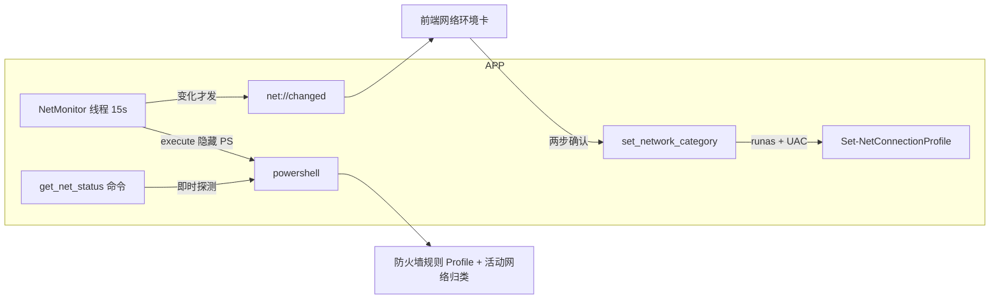

# 002-network-profile · 技术方案（plan）

> 导航：[spec.md](./spec.md) · [tasks.md](./tasks.md) · 返回 [MOC](../MOC.md)

- **状态**: reviewed
- **关联需求**: [spec.md](./spec.md)
- **最后更新**: 2026-09-09

## 1. 方案概述

程序内等效实现，不新增 sprint0 脚本（与 spec 001"菜单内联逻辑程序内移植"同一先例）。检测走 **PowerShell 隐藏执行**（`Get-NetFirewallRule` + `Get-NetConnectionProfile`，两者均无需管理员——读取策略与连接档案为普通用户权限），一次调用返回 JSON 由 Rust 解析；修改走 **ShellExecuteW runas 提权**（`Set-NetConnectionProfile`，UAC 弹窗），结果不回流管道、以复测为准（与 spec 001 提权脚本约定同款）。Rust 侧 15s 轮询，状态**变化才发** `net://changed` 事件；前端主界面新增"网络环境"卡。

## 2. 技术选型

| 领域 | 选型 | 理由 | 放弃的备选及原因 |
|------|------|------|------------------|
| 检测通道 | PowerShell 隐藏执行（一次调用合并规则+网络查询，输出 JSON） | 无新增依赖；与 sprint0/APP 既有执行口径一致；逻辑集中在脚本串便于对齐 Windows 语义 | Rust 原生 COM（NetworkList Manager + NetFwPolicy2）：两个 COM 面只为省一次进程拉起，不值 |
| 轮询节奏 | 独立线程 15s（AC 上限 30s），变化才发事件 | 组件状态 2s 轮询共享会让 PS 拉起过频；事件按变化去重免前端抖动 | 复用 2s poller：PS 进程 2s/次浪费 |
| 修改通道 | `ShellExecuteW verb=runas` 派发 `Set-NetConnectionProfile -InterfaceIndex N -NetworkCategory Private|Public` | 复用既有 elevate 原语与 UAC 拒绝文案（`shell_error_text`）；结果经轮询复测闭环 | 程序内自提权：需整段提权基础设施，过度设计 |
| 前端确认 | 两步内联确认（首次点击变"确认"态 + 风险文案，30s 未确认自动还原——需求方定时长，给足阅读风险时间） | 零依赖、可测；风险说明先于执行（AC5） | 系统对话框：Tauri 无内置 confirm 插件，引入 dialog 插件为单一用途不值 |

## 3. 架构设计

- **Rust**：新模块 `network.rs`——`NetStatus`/`NetworkEntry`（camelCase serde）、`detect_spec()`（隐藏 CommandSpec）、`parse_net_status()`（JSON→类型，容错单/多网络）、`needs_alert()`（纯函数：`rule_private_only && networks.any(Public)`）、`set_category_params()`（提权参数串构造）、`NetMonitor`（executor 注入、last 缓存、事件出口 trait 可 mock）。
- **接线**：`commands.rs` 增 `get_net_status`（spawn_blocking 即时探测）与 `set_network_category`（校验 + runas 派发，UAC 拒绝 → `shell_error_text`）；`lib.rs` 注册命令并在 setup 末尾启动 monitor 线程（随进程生命周期，与 2s poller 同款句柄语义）。
- **前端**：`api.ts` 增 `getNetStatus`/`setNetworkCategory`/`onNetChanged`；`MainView` 状态卡与地址区之间插"网络环境"卡：告警时顶部提示条（网络名 + 公用 + 域名后果三要素，AC1），逐网络行显示名称 + 归类 chip + 切换按钮（两步确认，AC5/AC6/AC8）；域网络不提供切换。
- **归类值映射**（Windows 语义，真机实测订正）：NetworkCategory 0=Public / 1=Private / 2=Domain；防火墙 Profile 为 flags（**Any=0、Domain=1、Private=2、Public=4**，NetSecurity.Profile 枚举）。`private_only = 规则存在 ∧ Profile≠Any(0) ∧ (Profile & Public=4)==0`。

## 4. 数据模型

无持久化。`NetStatus { rule_present, rule_private_only, networks: [{name, if_index, category}], alert }` 仅为内存态 + 事件载荷。

## 5. 接口契约

- 命令：`get_net_status() -> NetStatus`；`set_network_category(if_index: u32, category: "private"|"public") -> Result<(), String>`（立即返回，生效以 `net://changed` 为准）。
- 事件：`net://changed`，载荷 = NetStatus（变化才发）。
- 探测 PS 输出契约（`ConvertTo-Json -Compress`）：`{"rulePresent":bool,"privateOnly":bool,"networks":[{"name":str,"ifIndex":int,"category":int}]}`。
- 提权参数串：`-NoProfile -NonInteractive -WindowStyle Hidden -Command "Set-NetConnectionProfile -InterfaceIndex <n> -NetworkCategory <Private|Public>"`。

## 6. 测试策略

| AC | 覆盖方式 |
|----|----------|
| AC1/AC2（提示判定） | `needs_alert` 纯函数单测（规则缺失/Any/含 Public/纯专用网络等分支）+ `parse_net_status` 单测（多网络/单网络/容错） |
| AC3/AC4 | AC3：轮询复测闭环由 monitor 单测（探测序列驱动）+ 手工验收；AC4：探测失败保持 last 状态、不报错（单测） |
| AC5/AC6（切换） | `set_category_params` 构造单测（方向、if_index、参数完整性）；UAC 流程 + 实际生效为手工验收清单 |
| AC7（失败反馈） | UAC 拒绝 → `shell_error_text(5)`（既有单测覆盖该映射）；命令校验非法 category → Err（单测） |
| AC8（多网络） | 解析与前端渲染逐网络行（解析单测 + 手工清单） |
| 文案双语 | 前端词条 zh/en 键集一致（构建期类型约束） |

真机辅助验证：探测命令在开发机直跑（当前 LiuGong-Guest-t=Public、规则 Private-only → 应判告警，AC1 实证）。

## 7. 风险与对策

| 风险 | 影响 | 对策 |
|------|------|------|
| `Get-NetFirewallRule` 在某些环境被策略限制 | 探测失败 | 静默降级保持上次状态（AC4），不报错不阻塞 |
| PS 拉起慢（冷启动 ~1s） | 命令首查稍慢 | spawn_blocking 不冻结 UI；15s 轮询摊薄 |
| 用户改归类瞬间跨 UAC 后状态延迟 | 提示最长 15s 后消失 | AC3 允许 ≤30s；前端切换成功后可主动 getNetStatus 加速收敛 |
| 修改瞬间网络已切换（if_index 失效） | 命令失败 | PS 非零退出无回流——轮询复测以实况为准，不误报成功文案 |
| 防火墙规则被用户改名 | 探测判"规则不存在"→ 不提示 | 规则名是 sprint0 契约（spec §5 假设）；文档已知边界 |

## 8. 影响范围

- 新增：`src-tauri/src/network.rs`
- 修改：`src-tauri/src/lib.rs`（mod + 命令注册 + monitor 启动）、`src-tauri/src/commands.rs`（两命令）、`src/api.ts`、`src/types.ts`、`src/components/MainView.tsx`、`src/i18n/{zh,en}.ts`、`src/styles/app.css`
- 文档：CHANGELOG（Added）、本目录三文档、MOC
- 不改：既有脚本、编排器/停止管线、设置结构

## 变更记录

| 日期 | 变更内容 | 原因 |
|------|----------|------|
| 2026-09-09 | 初稿 | spec reviewed 后方案细化；开放问题四项全部落定（§2/§3） |
