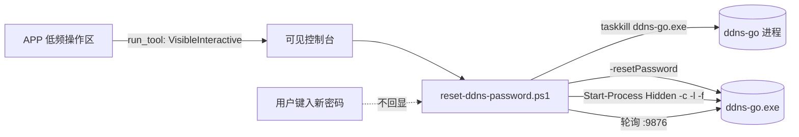

# 003-ddnsgo-password-reset · 技术方案（plan）

> 导航：[spec.md](./spec.md) · [tasks.md](./tasks.md) · 返回 [MOC](../MOC.md)

- **状态**: reviewed
- **关联需求**: [spec.md](./spec.md)
- **最后更新**: 2026-09-09

## 1. 方案概述

沿用 spec 001 已验证的"脚本本体 + GUI 编排壳"分层：密码重置的全部敏感逻辑（交互输入、进程控制、配置写入）沉到 sprint0 交互式脚本 `reset-ddns-password.ps1`，APP 只做"拉起可见交互窗"的通道（与 `install-client` 同款，spec 001 §4.3 交互式脚本约定）。密码经控制台 `Read-Host -AsSecureString` 键入（不回显），不接触前端与 IPC；唯一固有暴露为 ddns-go `-resetPassword` 进程命令行（秒级，spec §5 已声明接受）。

## 2. 技术选型

| 领域 | 选型 | 理由 | 放弃的备选及原因 |
|------|------|------|------------------|
| 密码输入 | 控制台 `Read-Host -AsSecureString` | 不回显、不进 APP/IPC/日志 | APP 输入框：密码流经前端状态与 invoke IPC，暴露面更大 |
| 重置通道 | ddns-go 官方 `-resetPassword <新密码>` | 官方接口，无需逆向哈希或手改 yaml | 手改 yaml `user:` 段：需自实现 bcrypt 哈希，风险高 |
| 停止/重启 | 脚本内 `taskkill`（按进程名）+ `Start-Process -WindowStyle Hidden`（按生产参数） | 用户级进程无需 UAC；隐藏窗避免桌面残留控制台 | APP 托管停止/重启：跨进程编排复杂化，脚本独立性差 |
| 就绪复核 | 轮询 `Test-NetConnection 127.0.0.1 -Port 9876`（简化为 `Net.Sockets.TcpClient`） | 与 APP 探活同口径（端口 Listen） | 读 ddns-go 日志：无契约保证 |

## 3. 架构设计

- 脚本常量：`$StackDir = 'D:\Software\cloudcli-https'`（与 install-server 同约定）；重启参数与 `consts.rs` 对齐（`-c <yaml> -l :9876 -f 300`）。
- APP 侧零新增命令：复用 `run_tool` 通道，`ToolKind` 扩一个枚举值。

## 4. 数据模型

无新增持久化。读 `ddns-go.yaml` 的 `user.username`（只读展示）；不写 yaml（写入由 ddns-go `-resetPassword` 完成）。

## 5. 接口契约

- **脚本 CLI**：`reset-ddns-password.ps1 [-Lang zh|en]`；退出码：0 成功、1 前置/执行失败（与其他脚本一致）。
- **ToolKind**：新增 `"reset_ddns_password"`（serde snake_case，前端 types.ts 同名）。
- **可见性**：`Visibility::VisibleInteractive`（无 UAC、`-NoExit` + 收尾提示，继承问题 3 修复后的 `-Command` 包装）。
- 无新 Tauri command、无事件、无设置项。

## 6. 测试策略

| AC | 覆盖方式 |
|----|----------|
| AC1/AC2/AC3/AC4/AC5/AC6 | 控制台交互流程：手工验收清单（真实重置 E2E 须由用户键入密码；另附非交互辅助验证：语法解析、yaml 用户名读取、脚本 dry 片段） |
| AC7 | Rust 单测：`tool_plan(ResetDdnsPassword)` → VisibleInteractive（非 elevated）、参数含脚本名与 `-Lang`；前端构建通过 |
| AC8 | 既有脚本可用性机制回归（SENTINEL 不变，入口自动随 ToolKind 禁用）+ 单测 |
| AC9 | 设计保证（SecureString 输入 + 不落日志的通道）；代码评审项：确认脚本无 echo/日志输出密码 |

## 7. 风险与对策

| 风险 | 影响 | 对策 |
|------|------|------|
| `-c` 漏带改错默认路径文件 | 重置落空、白改 | 脚本硬编码 `-c`；重启参数集中一处常量 |
| 密码进 ddns-go 进程命令行 | 任务管理器短暂可见 | spec 声明接受（秒级、本机自用）；文档明示 |
| 重启后 APP 显示滞后 | 用户困惑 | APP 前台 2s 轮询自动感知，无需处理 |
| ddns-go 停止失败（权限） | 脚本继续重置但旧进程仍持 yaml | 停止后复核进程不存在，失败即终止 |
| 运行中 ddns-go 周期性回写 yaml 覆盖重置 | 重置失效 | 先停进程再重置（流程顺序保证） |

## 8. 影响范围

- 新增：`tools/sprint0/bin/reset-ddns-password.ps1`
- 修改：`scripts/build.ps1`（`ScriptSubset` +1）、`apps/workbench/src-tauri/src/scripts.rs`（Script/ToolKind/interpret_exit + 单测）、`apps/workbench/src/types.ts`、`apps/workbench/src/i18n/{zh,en}.ts`、`apps/workbench/src/components/ToolsSection.tsx`
- 文档：`CHANGELOG.md`（Added）、本目录三文档、`specs/MOC.md`
- 不改：既有脚本、`consts.rs`、Tauri command 层、设置结构

## 变更记录

| 日期 | 变更内容 | 原因 |
|------|----------|------|
| 2026-09-09 | 初稿 | spec 确认后方案细化 |
