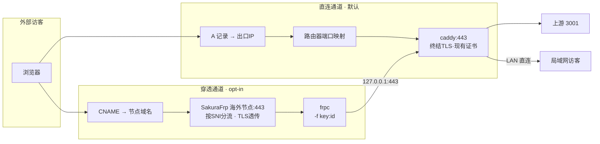
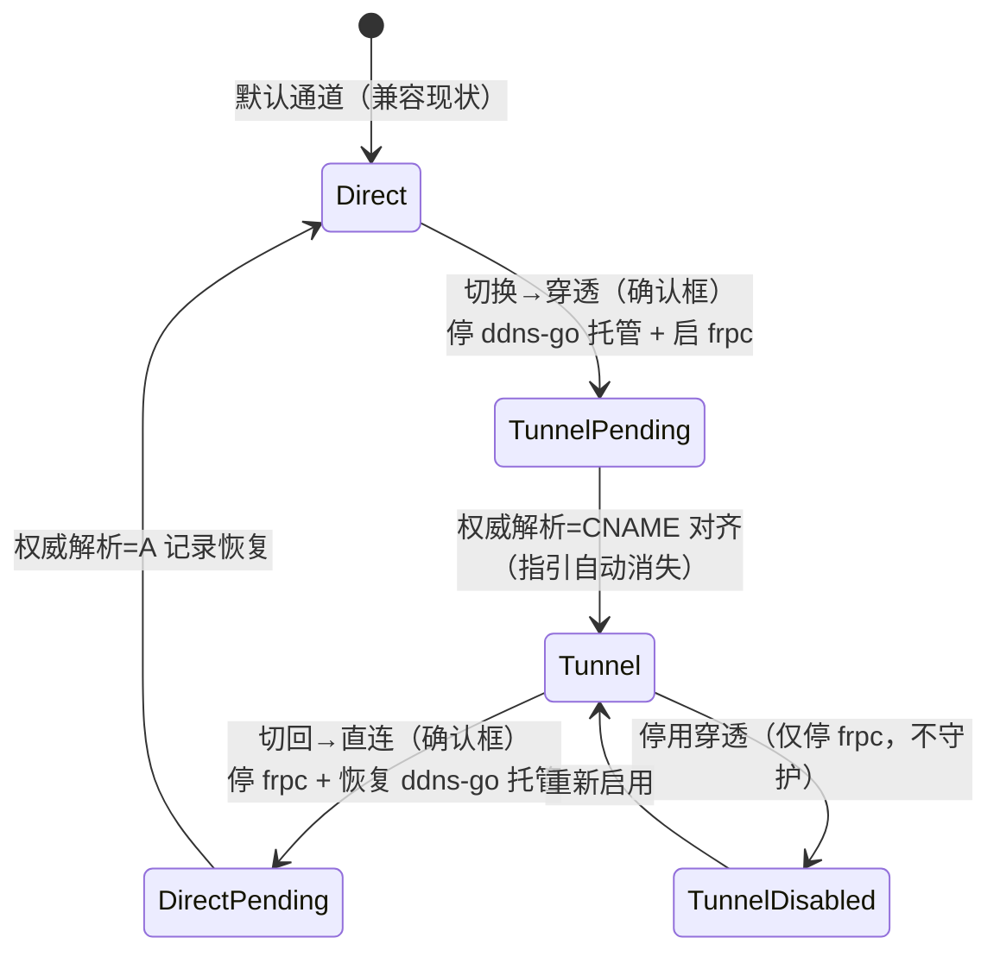

# 004-tunnel-access · 技术方案（plan）

> 导航：[spec.md](./spec.md) · [tasks.md](./tasks.md) · 返回 [MOC](../MOC.md)

- **状态**: draft <!-- draft | reviewed -->
- **关联需求**: [spec.md](./spec.md)
- **最后更新**: 2026-09-09

## 1. 方案概述

在现有 HTTPS 栈（caddy:443 → 3001）之上引入**访问通道（AccessChannel）**概念：`direct`（现状直连，默认）/ `tunnel`（SakuraFrp 穿透），通道选择持久化于工作台 Settings，两者**互斥运行**。穿透采用 SakuraFrp **HTTPS 隧道**（节点按 SNI 分流、TLS 透传到本地），本地终点为现有 caddy:443——**证书与 caddy 配置零改动**（caddy 已持有 `ai.jackqi.cn` 真证书，DNS-01 续期不依赖入站）。隧道客户端为 SakuraFrp 定制版 frpc（命令行 `frpc -f <key>:<id>`），由工作台 spawn/停止并新增**守护循环**（应运行而死亡 → 退避重启）。DNS 切换（A ⇄ CNAME）由用户在腾讯云控制台操作，工作台做权威解析比对与双向指引。

## 2. 技术选型

| 领域 | 选型 | 理由 | 放弃的备选及原因 |
|------|------|------|------------------|
| 穿透服务商 | SakuraFrp（海外建站节点，实际部署 `frp-can.com`） | 免实名门槛已过、免费档 2 隧道/10Mbps、HTTPS 隧道标准 443、非内地节点免备案（官方文档实证） | Cloudflare Tunnel（国内速度实测差 + 需迁 NS）；自建 frp+VPS（花钱，记为未来升级）；花生壳/cpolar 免费档（1Mbps + 随机域名） |
| 隧道类型 | HTTPS 隧道 + 「创建 HTTP 重定向」开关 | 标准 443 访问；重定向开关省一条隧道（免费档仅 2 条）；TLS 透传端到端（节点只见密文） | TCP 隧道（远程端口随机，访问须带端口号）；HTTP 隧道（明文） |
| TLS 终结 | 本地 caddy（现状不变） | caddy 已有 acme.sh DNS-01 签发的真证书；frpc→caddy 走 127.0.0.1，零新证书、零配置变更 | 节点终结（证书需交付第三方/上传同步，续期后还要重传） |
| 隧道客户端 | SakuraFrp 定制版 frpc（Windows amd64） | 命令行 `frpc -f <key>:<id>`，无头友好，工作台可直接托管 | 官方启动器（GUI，与工作台托管语义冲突） |
| access key 存放 | 栈目录 `.env`（`D:\Software\cloudcli-https\.env`） | 宪法 §3：凭证走环境配置；延续 003「密码不进 APP/IPC/日志」哲学 | settings.json（明文落盘且属 APP 数据）；APP 输入框（走 IPC 违反 003 哲学） |
| DNS 检测 | spawn `nslookup` 查 CNAME + 比对 | 零新依赖；权威比对逻辑可纯函数化 | 引入 DNS crate（为一次查询引入依赖不值） |

> 选型均未达「全局级」（语言/框架/数据库），不另立 ADR；服务商依赖风险见 §7。

## 3. 架构设计

### 3.1 双通道数据流



两条通道共用 caddy 及其后端；差异仅在「流量如何到达 caddy:443」与「DNS 指向」。

### 3.2 通道状态机（互斥核心）



`TunnelPending/DirectPending` 为过渡态：组件已切换，等待用户完成外部 DNS 操作（指引显示中）。守护仅作用于「当前通道应运行且已启用」的组件。

### 3.3 守护循环

复用 `orchestrator.rs` 现有轮询（`spawn_poller`，前台 2s），在状态刷新处追加守护判定：

```
每轮：for 组件 in [frpc（穿透模式∧已启用）]:
  应运行 ∧ 进程死亡 ∧ 距上次重启 ≥ 退避间隔 → start_one(退避)
退避序列：5s → 15s → 60s（封顶循环）；进程稳定运行 ≥5min 后重置
```

ddns-go **不纳入守护**（spec 范围仅隧道客户端；直连通道行为保持现状）。

## 4. 数据模型

### 4.1 Settings 扩展（`settings.rs`，向后兼容迁移）

```rust
pub enum AccessChannel { Direct, Tunnel }   // 默认 Direct；反序列化缺省/非法值回落 Direct

pub struct TunnelConfig {
    pub tunnel_id: String,    // SakuraFrp 隧道 ID（非敏感，可进 settings.json）
    pub node_domain: String,  // 节点域名，如 frp-can.com（DNS 比对目标）
}

pub struct Settings {
    // ...现有字段不动...
    pub access_channel: AccessChannel,      // 新增，缺省 Direct
    pub tunnel: Option<TunnelConfig>,       // 新增，None = 穿透未配置（AC7 入口不可用）
    pub tunnel_enabled: bool,               // 新增：穿透模式下是否启用运行（停用态用）
}
```

### 4.2 敏感凭证（不入 APP 数据）

- 栈目录 `.env` 新增约定：`SAKURA_FRP_KEY=<访问密钥>`；根目录 `.env.example` 同步登记变量名与用途。
- frpc 启动时由 Rust 读 `.env` 拼装 `-f <key>:<id>`；key 不进日志、不进事件、不进 settings.json。
- 已知暴露面：进程命令行含 key（本机其他本地用户经 WMI 可见）——单人自用场景接受，缓解：`enable-https.ps1` 已将栈目录置于用户profile 外的固定路径，文档提示保持登录用户唯一；风险表持续跟踪。

### 4.3 frpc 部署（随包分发）

`frpc.exe`（定制版 `0.51.0-sakura-14`，Windows amd64，SHA256 `b70526…5234`）**入库并随安装包分发**：存 `apps/workbench/src-tauri/resources/bin/frpc.exe`，经 tauri `bundle.resources`（`resources/bin/*`）进安装包与便携 zip——**换机开箱即用，无需下载**。运行时解析顺序 = 资源目录（exe 同级 `resources/bin`，沿 `scripts::locate`）→ 栈目录回退（兼容既有部署）；kill/探测按可执行名 `frpc.exe` 匹配（覆盖两种来源）。frp 版本迭代慢且本项目仅用基础隧道功能，版本锁定 + 入库的仓库膨胀代价（14MB 一次性）低于换机部署摩擦（需求方 2026-09-09 决策）。

## 5. 接口契约（Tauri commands / events）

| 名称 | 类型 | 签名（语义） | 对应 AC |
|------|------|--------------|---------|
| `switch_channel` | command | `(target: AccessChannel) -> SwitchOutcome`；校验前置（tunnel 配置就绪、key 存在），原子执行停旧启新 + 持久化 | AC5/6 |
| `set_tunnel_enabled` | command | `(enabled: bool) -> Result`；停用/重启用（不切通道） | AC11 |
| `check_dns_alignment` | command | `() -> DnsAlignment { aligned, kind: cname\|a\|none, detail }`；权威解析比对 | AC12/13 |
| `statuses` 事件 | event | 现有 `status://changed` 扩展：`ComponentStatus` 增加 frpc；通道与过渡态随 settings 下发 | AC1/4 |
| settings get/save | command | 现有命令，结构扩展向后兼容 | AC8 |

`ComponentId` 枚举追加 `Frpc`（第 4 组件）；`COMPONENT_ORDER` 调整为通道感知（UI 按「当前通道应运行的组件」渲染）。

## 6. 测试策略

| AC | 覆盖方式 |
|----|----------|
| AC5/6/8 通道切换与互斥 | 纯函数单测：状态机迁移表（当前通道×目标通道×配置就绪度 → 动作集/拒绝原因）；集成测试：切换原子性（停旧启新序、持久化往返） |
| AC7 未配置降级 | 单测：`tunnel: None` → 切换入口拒绝原因 + 组件编排无 frpc |
| AC3 守护拉起 | 单测：守护决策函数（应运行×存活×退避时钟 → 重启/等待）；集成：进程被杀 → 退避后拉起（测试用假进程） |
| AC12/13 DNS 对齐 | 纯函数单测：nslookup 输出样本（CNAME 指向 natfrp.cloud / 残留 CNAME / 已恢复 A / 无记录）→ 判定 |
| AC1 外部可达 / AC2 换网重连 / AC4/9/10 UI 与自启收摊 | 手工验收清单（真机：外部独立网络探测 + 切热点实测 + 杀进程实测；宪法 §1 窄例外） |

回归红线：现有 134 项自动化测试全绿为合并前提。

## 7. 风险与对策

| 风险 | 影响 | 对策 |
|------|------|------|
| SakuraFrp 免费档条款变化（如绑自定义域名受限） | 穿透通道不可用 | T1 建隧道时即时验证；通道互斥架构保证直连随时回退 |
| 海外节点速度不达预期（免费档 10Mbps + 线路波动） | 远程体验差 | 验收真机实测如实记录；不达标属预期内（spec §5），升级路径（自建 VPS）已记 spec 开放问题 |
| frpc 命令行暴露 access key | 本机其他用户可读 | 单人自用接受；文档提示；未来评估配置文件/环境变量通道 |
| CNAME 公共解析缓存致切换观察延迟（TTL 内旧记录） | 用户误判切换失败 | 指引检测以权威 DNS 为准；文案说明公共解析生效窗口 |
| frpc 下载源不可达 / 版本漂移 | 打包失败 | manifest 锁哈希；文档附手动下载与校验步骤 |
| 通道切换瞬间服务中断（frpc↔ddns-go 交替） | 切换窗口内不可达数秒 | 切换前确认框明示；指引阶段域名本就未对齐，无额外损失 |
| ddns-go 无守护的既有缺口 | 直连模式下进程死亡不自愈 | 本 Spec 明确不扩范围（YAGNI）；遗留记录，必要时另立小 Spec |

## 8. 影响范围

### 8.1 DNS 自动切换（2026-09-10 增补，见 spec 变更记录）

- **模块**：新增 `dns_api.rs`——TC3 签名（对齐官方 SDK 形态：**只签 `content-type;host` 两头、Content-Type 为 `application/json` 无 charset、CanonicalRequest 的 headers 段与 SignedHeaders 段之间有空行**——通用 TC3 文档的三头形态实测被网关拒 `AuthFailure.SignatureFailure`）；API 端点 `dnspod.tencentcloudapi.com`（service=dnspod，2021-03-23）。
- **凭证**：复用机器上 ddns-go 既有的腾讯云密钥（读 `.env` 的 TENCENT_SECRET_ID/KEY → `ddns-go.yaml` dnsconf 段回退），不新增用户输入；凭证不进日志。
- **调和语义（暂停/激活，需求方提议）**：切穿透 = 全部 A 暂停（ModifyRecordStatus DISABLE）+ CNAME 激活/新建；切直连 = 全部 CNAME 暂停 + A 激活（A 值由 ddns-go 维护/新建）。记录 ID 保留，完全可逆；`reconcile` 为纯函数幂等（已满足 → 空操作集）。
- **降级**：凭证缺失/API 失败 → 仅日志告警，不阻断切换；DNS 检测循环继续显示手动指引（既有闭环）。
- **依赖**：`ureq`（rustls）+ `sha2`/`hmac`/`hex`（RustCrypto 成熟库，仅 TC3 签名用）——宪法 §3 依赖说明即此。
- **验证**：真机调和（A 停 + CNAME 活）后 `https://ai.jackqi.cn/` HTTP 200 端到端（2026-09-10）。

- **Rust**：`settings.rs`（结构扩展+迁移）、`orchestrator.rs`（frpc 组件化+守护+切换原子操作）、`commands.rs`（3 新命令）、`consts.rs`（路径/常量）、新增 `tunnel.rs`
- **前端**：主界面新增「访问通道」卡（通道显示/切换确认/隧道状态/DNS 指引条）；双语文案
- **打包**：`resources/bin/frpc.exe` + manifest；`scripts/build.ps1` 同步；`tools/sprint0/bin` 打包副本
- **配置**：根 `.env.example` 登记 `SAKURA_FRP_KEY`；装机语义不变（`enable-https.ps1` 不改）
- **文档**：`CHANGELOG.md` Unreleased、`README` 目录说明（如涉及）、`specs/MOC.md` 状态流转
- **不改动**：caddy/Caddyfile、证书链（acme.sh DNS-01）、上游 3001、ddns-go 本体与配置

## 变更记录

| 日期 | 变更内容 | 原因 |
|------|----------|------|
| 2026-09-09 | 初稿 | spec reviewed 后落定 6 项开放问题：frpc 命令行接入、HTTPS 隧道 TLS 透传至本地 caddy、DNS-01 续期实证免迁移、守护退避策略、停用交互（TunnelDisabled 态）、nslookup 检测通道 |
| 2026-09-09 | §4.3 修正：frpc.exe 不入仓库/打包，改栈目录部署 + 存在性检查 | 发现 `resources/bin` 定位仅为 sprint0 脚本副本，项目惯例二进制不入库（caddy/ddns-go 先例）；manifest 亦非 Rust 消费而是打包说明清单 |
| 2026-09-09 | §4.3 再修订：frpc.exe **入库并随包分发**（resources/bin → tauri bundle.resources），运行时资源目录优先/栈目录回退 | 需求方："开箱自带 frpc"——frp 迭代慢、仅用基础功能，版本锁定入库的一次性膨胀（14MB）低于换机部署摩擦 |
