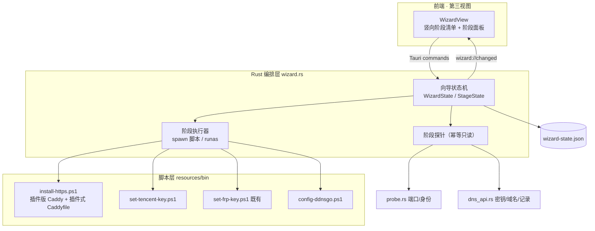

# 006-foolproof-install · 技术方案（plan）

> 导航：[spec.md](./spec.md) · [tasks.md](./tasks.md) · 返回 [MOC](../MOC.md)

- **状态**: reviewed
- **关联需求**: [spec.md](./spec.md)
- **最后更新**: 2026-09-10

## 1. 方案概述

三层三明治：**脚本层**（resources/bin 专项脚本，各自可独立双击运行）+ **Rust 编排层**（新模块 `wizard.rs`：向导状态机、阶段探针、脚本派发、腾讯云校验）+ **前端向导视图**（第三视图 WizardView）。核心复用决策：TLS 获取改 Caddy tencentcloud 插件（ADR-0003）；腾讯云凭证/校验/DNS 切换**完全复用 004 既有资产**（`.env` 凭证回退链、`dns_api.rs` TC3 客户端与记录调和、switch_channel 语义），向导不新建平行机制。

## 2. 技术选型

| 领域 | 选型 | 理由 | 放弃的备选及原因 |
|------|------|------|------------------|
| 插件版 Caddy 分发 | 安装时从 `caddyserver.com/api/download` 按需构建下载（锁 `tencentcloud@v0.4.3`）+ `-CaddyZip` 本地兜底 | 构建服务已实测可用（HTTP 200）；零仓库膨胀；沿 install-https.ps1 惯例 | 预构建入库（40MB ≈ frpc 3 倍，安装包膨胀+版本churn）；自建 xcaddy 入 release（需维护 Go 工具链，零收益） |
| 腾讯云校验载体 | **Rust 原生复用 `dns_api.rs`** | 004 已建 TC3 客户端：密钥有效性/域名存在/记录对齐均可由 `read_credential` + `signed_request(DescribeRecordList)` 表达 | node 子脚本（跨进程 JSON 协议+node 前置，纯重复造轮子）；PS 原生签名（PS 5.1 手搓 HMAC 出错面大） |
| 密钥输入 | 新增 `set-tencent-key.ps1`（set-frp-key.ps1 同款：不回显、两次确认 → 栈 `.env` 的 `TENCENT_SECRET_ID/KEY`） | 凭证零 APP 化（宪法 §3、003/004 先例）；`dns_api.rs` 已有 `.env` 读取回退链 | APP 输入框（违反宪法 §3） |
| ddns-go 取 IP | **url 模式**（公网接口法，脚本生成 yaml 固化） | 直连目标即公网可达；`netInterface` 模式有写内网 IP 前科（004 spec §1） | 网卡模式（LAN 期遗产，假公网网络下写错记录） |
| CGNAT 判据 | 公网接口 IP ∉ 本机网卡 IP 集合 → NAT/CGNAT 警示 | 纯本机可判、零外部依赖；只判"直连前提缺失"，不冒充外部可达结论（005 口径纪律） | 外部探测服务（慢且不稳；日常外部视角归 005 心跳） |
| 向导状态持久化 | `%APPDATA%\ai-remote-workbench\wizard-state.json`，复用 settings.rs 的加载/损坏恢复/原子写模式 | 过程态与偏好态分离；断点续跑跨重启（AC2） | 并入 settings.json（向导状态非用户偏好，语义混淆）；不持久化（关窗丢进度违反 AC2） |
| DNS 切换（AC10） | 复用 004 `switch_channel` 的 `sync_to_tunnel/sync_to_direct` 自动执行，手动指引兜底 | 004 语义已升级"自动执行+手动兜底"；穿透分支前置已保证凭证就绪 | 纯手动指引（重复 004 已有能力） |

影响全局的选型（TLS 获取方式）已另立 **[ADR-0003](../../docs/adr/0003-caddy-dns-plugin-tls.md)**。

## 3. 架构设计



**阶段推进语义**（状态机核心）：

- **检测驱动**：每阶段先探测（幂等只读）——前置已满足 → `done`（自动跳过，AC2）；未满足 → `pending` 等待用户动作。
- **动作两类**：① 本地执行（阶段①③：spawn 装机脚本，进度与日志尾部回流）；② 外部办理（阶段②④：展示文字指引 + 打开控制台按钮，用户办完点「校验」→ 触发对应探针）。
- **失败隔离**：失败阶段置 `failed` + 可读原因；重试只重跑该阶段（AC12）；其余阶段状态不受影响。
- **分支互斥**：阶段④选定 `direct`/`tunnel` 后，另一分支置 `skipped`（AC9 ddns-go 不配置不启动的 UI 呈现）。

**阶段探针清单**（全部复用既有能力，新增代码仅为编排）：

| 阶段 | 探针 | 复用 |
|------|------|------|
| ① 基础 | 3001 监听且身份匹配（node.exe）；防火墙规则存在 | `probe.rs` classify |
| ② 腾讯云前置 | `read_credential` 有凭证；`DescribeRecordList(domain)` 可查（密钥有效+域名存在一并验证） | `dns_api.rs` |
| ③ HTTPS 栈 | caddy.exe/ddns-go.exe 落位；Caddyfile 存在且含 `dns tencentcloud`；443 监听 | 文件探测 + `probe.rs` |
| ④a 直连 | ddns-go.yaml 存在；9876 监听；A 记录 = 公网接口 IP | `probe.rs` + `dns_api.rs` + CGNAT 纯函数 |
| ④b 穿透 | SAKURA_FRP_KEY 存在；隧道 ID/节点域名已配置；frpc 日志"登录成功" | 004 tunnel 托管状态 |
| ⑤ 收尾 | 自启任务注册状态 | `autostart.rs` |

## 4. 数据模型

```rust
enum WizardStageId  { Basis, Tencent, Https, Channel, Finalize }
enum StageState     { Pending, Running, Done, Failed, Skipped }
struct StageStatus  { id: WizardStageId, state: StageState, detail: Option<String>, checked_at: u64 }
struct WizardState  {
    version: u32,
    stages: Vec<StageStatus>,          // 恒 5 项，顺序固定
    branch: Option<AccessChannel>,     // 阶段④选择（复用 settings 的枚举）
    domain: String,                    // 非敏感，默认 consts::DOMAIN
    done: bool,
    started_at: u64, updated_at: u64,
}
```

- 持久化 `%APPDATA%\ai-remote-workbench\wizard-state.json`；损坏 → 改名 `.bad-<ts>` 留档 + 回退全 pending（settings.rs 同款语义）。
- **敏感边界**：`TENCENT_SECRET_ID/KEY`、`SAKURA_FRP_KEY` 只存在于栈目录 `.env`，不进 WizardState/事件/日志（宪法 §3）。
- 隧道 ID / 节点域名沿用 settings 的 `TunnelConfig`（004 先例，非敏感）。

## 5. 接口契约

Tauri commands（事件 `wizard://changed` 载荷 = 全量 WizardState；前端零轮询）：

| 命令 | 签名 | 语义 |
|------|------|------|
| `wizard_get_state` | `-> WizardState` | 读当前状态持有者 |
| `wizard_detect` | `-> WizardState`（async） | 全阶段重探测（spawn_blocking；外部办理/脚本跑完后的统一「校验」入口） |
| `wizard_set_branch` | `(AccessChannel) -> WizardState` | 阶段④选择；**同步写 Settings.access_channel**——frpc 拉起/ddns-go 停托管复用 004 守护收敛 |
| `wizard_set_domain` | `(String) -> WizardState` | 非敏感域名输入（默认 ai.jackqi.cn） |
| `wizard_complete` | `-> WizardState` | done 置位（自启注册由前端复用 set_autostart_* 命令） |

**派发类动作不设独立命令**：装机/密钥脚本由前端复用既有 `run_tool`（新增 ToolKind `set_tencent_key`/`config_ddnsgo`；`ToolOpts` 增 `domain` 透传自定义域名到 install-https/config-ddnsgo 的 `-Domain`）——UAC/可见窗/退出码语义全部沿用 AC19/20，向导只负责状态与校验。

**凭证流向（安全边界）**：键盘 → `set-tencent-key.ps1`（不回显）→ 栈 `.env` → `dns_api::read_credential`（内存）→ API 校验；全程不经 APP 进程/IPC/日志。

**脚本契约**：

| 脚本 | 参数 | 行为 |
|------|------|------|
| `install-https.ps1`（改造） | `-Lang`；`-CaddyZip` 兜底 | 步骤 2 的 Caddy 下载源改为按需构建 API；步骤 3 的 Caddyfile 模板改插件式（`tls { dns tencentcloud {env.TENCENT_SECRET_ID} {env.TENCENT_SECRET_KEY} }`）；既有 Caddyfile 存在不覆盖（幂等惯例不变） |
| `set-tencent-key.ps1`（新） | `-Lang` | 不回显输入 SecretId/Key → 两次确认 → 写栈 `.env`（原位替换/追加，其余行保留）→ 复核仅显示 ID 末 4 位 |
| `config-ddnsgo.ps1`（新） | `-Domain` `-Lang` | 从 `.env` 读凭证 → 生成 `ddns-go.yaml`（tencentcloud + url 模式 + 域名）→ 启动 ddns-go |
| Caddy spawn（Rust 改造点） | — | 启动时从 `.env` 读入并注入 `TENCENT_SECRET_ID/KEY` 环境变量（Caddyfile `{env.*}` 消费，密钥不落明文配置） |

## 6. 测试策略

| AC | 覆盖方式 |
|----|----------|
| AC1/2 检测与断点续跑 | 单测：探针纯函数（文件/端口/凭证存在 → 阶段态推导）；wizard-state 加载/损坏恢复/前后向兼容 |
| AC3 基础阶段 | 单测：阶段执行器命令构造断言；手工：真机装机计时 |
| AC4/5 密钥/域名校验 | 单测：凭证缺失→pending、API 错误码→可读原因映射（AuthFailure→密钥无效、权限类→权限不足、域名类→不存在）；真机：错/对密钥各跑一次 |
| AC6/7 HTTPS 栈 | 手工：真机装机（下载→生成→启动→443 证书有效）；单测：Caddyfile 模板参数化 |
| AC8 A 记录 + CGNAT | 单测：记录对齐判定、CGNAT 纯函数（公网 IP × 网卡集合交集）；真机：603 蜂窝网络警示 |
| AC9 frpc 接入 | 单测：隧道 ID 纯数字校验；托管/守护复用 004 已测逻辑；真机：隧道在线 + ddns-go 未启动 |
| AC10 DNS 切换 | 复用 004 reconcile 单测；真机：切穿透→检测一致→指引消失 |
| AC11/12 收尾/失败隔离 | 单测：finalize 状态迁移、失败不传染已完成阶段 |
| AC13/14 低频栏瘦身 | 手工验收清单（按钮清单核对 + 跳转定位） |

GUI 视觉/交互项（布局、chip 配色、滚动、折叠）→ 手工验收清单 `acceptance-manual.md`（宪法 §1 窄例外）。

## 7. 风险与对策

| 风险 | 影响 | 对策 |
|------|------|------|
| caddyserver.com 构建慢（实测 ~36KB/s 含编译，全程分钟级） | 阶段③体验拖长 | 脚本分步进度+预计时间提示；幂等跳过已完成；`-CaddyZip` 本地兜底 + 手动下载页 URL 透出 |
| tencentcloud 插件停止维护 | 新机无法自动签证 | ADR-0003 记录回退路线（脚本包装 acme.sh）；版本锁定 + manifest 登记 |
| 插件版 Caddy 与旧机 acme.sh 证书链共存 | 旧机重跑脚本行为漂移 | Caddyfile 存在不覆盖；旧机不迁移（spec 非目标） |
| 用户使用了无 DNSPod 权限的密钥 | 阶段②卡住 | 错误码→可读文案映射（AuthFailure/权限类/域名类），指引建最小权限子用户 |
| Caddy 以 `{env.*}` 引用密钥，环境变量缺失时启动行为 | 证书签发静默失败 | spawn 前校验 `.env` 凭证存在（探针②前置保证）；失败日志摘要透出（AC7） |
| 向导与 004 通道切换并发 | 状态竞态 | 向导穿透分支复用 `switch_channel` 单一入口，不另起平行路径 |

## 8. 影响范围

- **新增**：`src-tauri/src/wizard.rs`、`resources/bin/{set-tencent-key.ps1, config-ddnsgo.ps1}`、`src/components/WizardView.tsx`
- **修改**：`install-https.ps1`（下载源+Caddyfile 模板）、`commands.rs`/`lib.rs`（命令与事件注册）、caddy spawn 环境注入、`ToolsSection.tsx`/`MainView.tsx`（AC13/14）、`i18n/{zh,en}.ts`、`types.ts`/`api.ts`、`scripts/build.ps1`（脚本副本清单）、`resources/bin/manifest.json`、`CHANGELOG.md` Unreleased
- **不动**：既有装机 Caddyfile（幂等不覆盖）、frpc 托管（004）、心跳（005）、probe/orchestrator 语义

## 变更记录

| 日期 | 变更内容 | 原因 |
|------|----------|------|
| 2026-09-10 | 初稿 | 收口 spec 三个开放问题：分发=安装时下载+zip 兜底；校验=Rust 复用 dns_api.rs（004 既有 TC3 客户端，node 方案作废）；ddns-go=url 模式 + 网卡交集 CGNAT 判据 |
| 2026-09-10 | 实现期修订：① wizard_run_stage/wizard_open_key_console 取消，派发复用 run_tool（+2 ToolKind、ToolOpts.domain）；② StageState 不设 Running（派发繁忙为前端局部态）；③ CGNAT 判据落地为"公网 IP ∈ 私网/CGNAT 段"纯函数 + warn_* 警示码（原"网卡交集"方案无法区分真出口）；计划任务路径的 {env.*} 注入由新脚本 run-caddy-hidden.ps1 承担 | 检测驱动架构下向导无需平行派发机制（简单优先）；详勘后更诚实的实现路径 |
