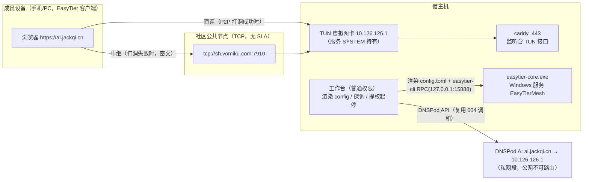

# 007-mesh-access · 技术方案（plan）

> 导航：[spec.md](./spec.md) · [tasks.md](./tasks.md) · 返回 [MOC](../MOC.md)

- **状态**: draft <!-- draft | reviewed -->
- **关联需求**: [spec.md](./spec.md)
- **最后更新**: 2026-09-10

## 1. 方案概述

用 EasyTier v2.6.4（**legacy 模式，传输加密由 network_secret 派生**）组建私有虚拟网络替代 frp 穿透：宿主机虚拟网卡持有虚拟 IP（默认 10.126.126.1），域名 A 记录指向该私网段 IP——公网不可路由，未持 network_secret 的设备在网络上不可达，实现「零公网暴露」。**easytier-core 以 Windows 服务形态运行**（非工作台 spawn）：TUN 网卡需要管理员权限，服务由 SYSTEM 承载一次安装、SCM 负责崩溃自愈与开机自启（先于用户登录可用），工作台角色转为「配置渲染者 + 服务观察者」——渲染 config.toml、经提权脚本起停服务、经 `easytier-cli` RPC 实时探询状态。默认对端为**社区公共节点**（实测 `public.easytier.cn` 已下线且官方从未托管公共服务器，见 §7 风险 R1），支持多对端可编辑，升级到自建 VPS 节点仅需改对端列表。停用直连/穿透 = 切换到组网通道的动作合一 + 独立停用入口（disabled 标记 + 重新启用须安全警示确认）。

> **secure-mode 降级决策（2026-09-10，T2 实测）**：原方案「宿主机 secure-mode + Android legacy 混合组网」经双实例真机实验证伪——v2.6.4 实测 ①secure 客户端连不上未开 secure 的服务端（社区节点），②同网络成员必须同为 secure，而 Android App 无 secure 配置 UI → 全链 secure 缺成员。legacy 模式安全边界：不泄露 network_secret 则无法加入、中继只见密文；弱点为无前向保密。secure↔secure 配置方法已实证（`[secure_mode] enabled + local_private_key + local_public_key` 成对 X25519 base64——v2.6.4 不自动派生公钥，help 文本与行为不符），升级路径见 §7-R4，实测报错原文见 tasks.md T2 附注②。

## 2. 技术选型

| 领域 | 选型 | 理由 | 放弃的备选及原因 |
|------|------|------|------------------|
| 组网引擎 | EasyTier v2.6.4（easytier-core + easytier-cli，windows-x64，legacy 模式） | 调研报告 P0 定案：Rust 实现、Noise/WG 原语、无公网 IP 可组网、WG 兼容；传输加密由 network_secret 派生（secure-mode 因成员兼容性阻塞，§1 降级决策） | Tailscale（移动网络 UDP QoS 丢包 + 控制面全境外）；WireGuard 裸用（需要公网 IP/VPS，本期非目标） |
| 运行形态 | **Windows 服务**（`sc create`，SYSTEM，delayed-auto + SCM failure recovery） | TUN/wintun 需管理员：服务一次安装后免每次提权；SCM 崩溃自愈（≤60s）强于应用层守护且不依赖工作台在跑；开机先于登录可用 | ①工作台直接 spawn（每次 UAC 弹窗、守护无法无人值守拉起，违背 AC3）；②计划任务最高权限（停止同样需提权、崩溃自愈语义弱、004 踩过任务结束杀子进程坑）；③--no-tun（宿主机必须持虚拟 IP 供成员访问 443，无 TUN 不成立）；④`easytier-cli service install` 官方装服务（网络参数进服务命令行——含密钥，违背 AC8；core 原生支持 SCM，binPath 由我们构造即可） |
| 默认对端 | 社区节点 `tcp://sh.vomiku.com:7910`（2026-09-10 实测解析正常，腾讯云上海） | `public.easytier.cn` 已 NXDOMAIN（本机 + 223.5.5.5 实测）；官方隐私政策明示不提供托管公共服务器；TCP 对端受 UDP QoS 影响小 | 官方公共节点（不存在）；单一硬编码对端（社区节点无 SLA，必须多对端 + 可编辑） |
| 凭证注入 | 栈目录 `easytier/network-secret` 文件（脚本交互写入）→ 工作台渲染进 config.toml（栈目录，ACL 已收紧） | AC8：命令行无密钥（修正 frpc 已知暴露面）；secret 与非敏感参数分离，工作台是 config.toml 唯一渲染者，无双源漂移 | 命令行传参（WMI 可读）；settings.json（明文库）；TOML `${VAR}` 环境变量展开（服务环境是 SYSTEM 的，注入路径别扭） |
| 状态探询 | `easytier-cli peer --rpc 127.0.0.1:15888 -o json`（rpc 仅绑 localhost） | RPC 实时接口无日志陈旧问题（004 教训）；127.0.0.1 绑定即安全边界 | 解析日志文件（004 踩过陈旧日志误判坑） |
| TOML 生成 | Rust `toml` crate（serde 序列化） | 配置结构体强类型渲染 + `--check-config` 办后校验 | 手写字符串模板（转义/缩进易错，006 Caddyfile 拼接坑同源） |

**第三方依赖登记（宪法 §3）**：

| 依赖 | 版本 | 许可证 | 用途与维护状态 |
|------|------|--------|----------------|
| easytier-core / easytier-cli | v2.6.4 | **LGPL-3.0**（2025-06 PR #951 起，非官网页脚所写 Apache-2.0） | 独立进程调用（服务方式拉起 exe），不链接其源码/二进制、不分发修改版 → 无 LGPL 传染义务。维护活跃（GitHub 活跃开发，2026 持续发版）；无 SECURITY.md、无第三方审计——以工程约束补（不用官方安装脚本、rpc 绑 127.0.0.1、版本锁 manifest+SHA256） |
| Rust crate `toml` | 0.8（MIT/Apache-2.0） | | config.toml 渲染；社区标准 crate、维护稳定 |

## 3. 架构设计

### 3.1 部署形态与数据流



要点：

- **流量单段加密模型（如实，2026-09-10 T2 实测定案）**：legacy 模式下全网成员（宿主机 + Android App）用 network_secret 派生密钥加密传输——中继节点（社区）只见密文（secure-mode 官方文档对旧模式的表述：密钥泄露才可能被窃听）；secure↔secure 混合组网被 v2.6.4 实测否决（§1 降级决策）。安全落点：AC8/AC9 的密钥注入与就绪强制（命令行无密钥、无密钥不启动）+ AC10 换钥即吊销。
- **工作台退出语义**：mesh 由服务承载，工作台崩溃/退出不影响组网（「退出保留服务」天然成立）；「停止服务并退出」收摊时经 UAC 停服务（低频 + 已有确认框，与 001「设为专用」UAC 惯例一致）。
- **caddy 不变**：已监听 `:443`（全接口），TUN 接口出现后 10.126.126.1:443 自动可达，无需改动 HTTPS 栈（spec 非目标）。

### 3.2 通道切换时序（switch_actions 扩展，三通道矩阵）

```
切换到 mesh：
  1.（若 frpc 在跑）StopFrpc —— 守护停止拉起
  2.（若 ddns-go 在跑）StopDdnsGo + 取消其自启托管 —— 防止把 A 记录写回公网 IP
  3. 渲染 config.toml（MeshConfig + secret）→ easytier-core --check-config 办后校验
  4.（服务未装）提示先装服务（向导/设置入口，UAC）；（已装）提权脚本重启服务
  5. DNS 调和：删除 CNAME（若存在）→ A 记录 upsert 值=虚拟 IP（UpdateValue）
  6. Persist(channel=mesh)

mesh → direct：StartDdnsGo（A 记录由 ddns-go 自愈回公网 IP）+ 提权停 mesh 服务 + Persist
mesh → tunnel：StartFrpc + CNAME 重建 + A 记录暂停 + 提权停 mesh 服务 + Persist（沿用 004）
```

### 3.3 守护与状态判定（AC3 映射）

| 004 语义（frpc） | 007 语义（mesh） |
|---|---|
| 工作台守护退避拉起（5s/15s/60s） | **SCM failure recovery**（`sc failure ... actions= restart/60000`×3）：进程被杀 ≤60s 自动拉回，不依赖工作台在跑 |
| 守护 tick 判活 + 日志实况 | 守护 tick 退化为**状态探询 + 如实上报**（`sc query` 服务态 + `easytier-cli peer` 实况）；RPC 实时接口无陈旧问题，不做应用层重启（重启需提权，提供手动按钮） |
| 自启 = 计划任务 | 自启 = 服务自身 `start= delayed-auto`（停用 mesh 时 `sc config` 改 disabled） |
| 收摊 spawn 树清理 | 收摊 = UAC 停服务（「停止服务并退出」入口） |

AC3 验收口径：杀掉 easytier-core 进程 → 看板「离线 → 在线」且恢复 ≤ 60s（SCM 承担拉起，工作台承担如实展示）。

### 3.4 DNS 调和扩展（dns_api.rs）

`reconcile()` 现有操作 `SetStatus`（暂停/激活）/ `Create`，新增 **`UpdateValue`**（记录 line 不变、改 value——A 记录公网 IP → 虚拟 IP，或反向）。停用场景的 CNAME 处理取**删除**语义（`Delete` 操作，AC5「彻底清理」；004 的暂停语义仅服务于通道互切的可逆需求，停用不是切换）。

## 4. 数据模型

### 4.1 settings.json 扩展（`%APPDATA%\ai-remote-workbench\`，非敏感）

```rust
enum AccessChannel { Direct, Tunnel, Mesh }   // serde lowercase："mesh"；旧文件无该字段默认 direct（兼容样板沿用）
struct Settings {
    channel: AccessChannel,                    // 默认 Mesh（新装机向导推荐组网分支）
    mesh: MeshConfig,                          // #[serde(default)]，全部字段带默认值
    tunnel_disabled: bool,                     // #[serde(default)] false
    direct_disabled: bool,                     // #[serde(default)] false
    // ……既有字段不动
}
struct MeshConfig {
    network_name: String,          // 默认 "ai-remote"
    virtual_ip: String,            // 默认 "10.126.126.1"（TOML 顶层 ipv4，dhcp=false）
    virtual_cidr: String,          // 默认 "10.126.126.0/24"（网段冲突检测输入）
    peers: Vec<String>,            // 默认 ["tcp://sh.vomiku.com:7910"]，可编辑多条
}
```

- `tunnel_disabled`/`direct_disabled` 驱动「已停用」看板态与重新启用警示（AC5/AC6）；**停用入口的前置条件**：目标通道非现役（如停用直连要求当前 channel ≠ direct），不引入「无通道」第四态。
- network_secret **不进** settings.json（AC8）。

### 4.2 栈目录新增布局（`<stack>/easytier/`，ACL 随 Protect-StackDir）

```
<stack>/easytier/
├── easytier-core.exe     # 安装时从 resources/bin 复制（版本+SHA256 校验，frpc 先例；T1 已入库）
├── easytier-cli.exe      # 同上；服务 binPath 与探询均用栈目录副本（升级解耦 + ACL 保护）
├── wintun.dll            # TUN 驱动库（easytier 官方包随附）——落位必须同带，否则服务起不来（T1 取证补充）
├── network-secret        # set-mesh-secret.ps1 交互写入（不回显 ×2、直写、复核末 4 位）
├── config.toml           # 工作台唯一渲染（含 secret 明文——AC8 口径：文件注入、命令行无密钥）
└── logs/                 # --file-log-dir（服务参数）
```

### 4.3 config.toml 渲染形态（工作台生成）

```toml
hostname = "ai-remote-workbench"   # 成员设备 peer 表显示名（T2 实测：hostname 字段生效；
                                   # instance_name 不进 peer 表 hostname 列）
ipv4 = "10.126.126.1"          # 顶层（非 [network_identity] 内——取证确认的字段位置）
dhcp = false
latency_first = true           # 直连优先，中继兜底
listeners = [                  # 收敛默认六协议全开（T2 实测默认 11010-11013 六端口）
  "tcp://0.0.0.0:11010",
  "udp://0.0.0.0:11010",
]

[network_identity]
network_name = "<mesh.network_name>"
network_secret = "<network-secret 文件内容>"

# 注：无 [secure_mode] 段 —— v2.6.4 legacy 产品形态（T2 实测：secure 与社区节点/
# Android App 不兼容，见 §1 降级决策）。升级路径：成员全 secure 时加
# [secure_mode] enabled + local_private_key + local_public_key（成对 X25519 base64，
# 实测 v2.6.4 必须成对显式、不自动派生公钥）。

[[peer]]
uri = "tcp://sh.vomiku.com:7910"
# ……peers 逐条
```

渲染前置校验（AC9 新语义）：network_secret 缺失/为空 → 拒绝渲染并返回「密钥未配置（脚本写入）」可读指引。

进程级参数不入 TOML，走服务 binPath：`easytier-core.exe -c <config> -r 127.0.0.1:15888 --file-log-dir <stack>/easytier/logs`（取证确认 rpc/日志参数仅在 CLI；日志目录须传 Windows 原生路径——msys 路径实测不落盘）。

### 4.4 Windows 服务定义

| 项 | 值 |
|---|---|
| 服务名 / 显示名 | `EasyTierMesh` / `AI Remote Workbench Mesh (EasyTier)` |
| binPath | `"<stack>/easytier/easytier-core.exe" -c "<stack>/easytier/config.toml" -r 127.0.0.1:15888 --file-log-dir "<stack>/easytier/logs"` |
| 启动类型 | delayed-auto（停用 mesh → disabled） |
| 恢复策略 | `sc failure reset= 86400 actions= restart/60000/restart/60000/restart/60000` |
| 安装/卸载/起停 | `mesh-service.ps1 -Action install|uninstall|start|stop|restart|status`（工作台经 ShellExecuteW runas UAC 提权拉起；脚本自检管理员身份、非提权即拒绝提示——install-https.ps1 实际惯例；status 只读免提权） |

## 5. 接口契约

### 5.1 Tauri 命令（新增）

| 命令 | 入参 | 出参/行为 | 提权 |
|---|---|---|---|
| `mesh_status` | — | `{ service: running/stopped/disabled, peers: [{uri, latency_ms, loss_rate}], state: online/connecting/offline/not_configured, detail }`（state 判定纯函数可测：服务 running 且 peer 列表含可用对端 → online；running 且无 peer → connecting） | 否（sc query / RPC 读取不需管理员） |
| `mesh_apply_config` | — | 渲染 config.toml → `--check-config` 校验（含 secure_mode 强制断言）→ 提权重启服务 → 回读 mesh_status | 是（内部拉 mesh-service.ps1） |
| `mesh_install_service` / `mesh_uninstall_service` | — | 复制 exe（校验 manifest）+ sc create + failure 配置 / sc delete（先 stop） | 是 |
| `disable_legacy_channel` | `{ target: "tunnel" \| "direct" }` | 停用编排（§5.2），前置校验非现役通道 | 停 ddns-go 托管部分否 / CNAME 删除走 API 否 |
| `clear_frp_key` | — | 指引呈现 + 拉起清除脚本（`clear-frp-key.ps1`：从栈 `.env` 移除 SAKURA_FRP_KEY 行、复核显示已移除） | 否 |

既有命令变更：`switch_channel` 入参枚举加 `"mesh"`；`channel_health`（体检）六项在 mesh 下重定义两项（隧道客户端→组网服务/对端、DNS 对齐→A 记录=虚拟 IP），其余不变；`get_settings`/`save_settings` 随 Settings 结构自动扩展（serde default 向后兼容）。

### 5.2 停用编排（AC5/AC6，动作定义）

```
disable_tunnel（前置：channel ≠ tunnel）:
  1. StopFrpc（若在跑）+ 守护停止
  2. DNS：删除 CNAME（frp-can.com；复用 DNSPod API，失败回退手动指引——004 惯例）
  3. tunnel_disabled = true → 看板「穿透/已停用」；重新启用入口带安全警示确认
  4. 呈现 SAKURA_FRP_KEY 清除指引（clear-frp-key.ps1，AC5 口径）

disable_direct（前置：channel ≠ direct；典型时序 = 切 mesh 后执行）:
  1. StopDdnsGo + 取消自启托管（004 start_all 互斥逻辑已具备）
  2. DNS：A 记录处理——mesh 在用时已指虚拟 IP（切换时完成，无动作）；非 mesh 态删除 A 记录（用户选择保留则跳过，AC6「按用户选择清理」）
  3. direct_disabled = true → 看板「直连/已停用」
  4. 腾讯云密钥保留（DNS 调和 + DNS-01 续期仍需，spec §4）
```

切换到 mesh 的流程内置提示「直连将随之停用」（动作合一：§3.2 第 2 步即停托管），`disable_direct` 作为显式确认与残留清理入口（含向导收尾页调用）。

### 5.3 前端契约

- `types.ts`：`AccessChannel = "direct" | "tunnel" | "mesh"`；`MeshConfigView`；设置区组网卡片（网络名/虚拟 IP/网段/对端列表行内编辑，保存即时校验：非空、IP/网段格式、peers URI 格式；**无密钥输入框**，仅脚本指引链接——AC8/AC11）。
- `TunnelCard.tsx`（保留文件名，004 遗产避免无谓 diff）：三通道单选 + 停用态渲染（「已停用」chip + 「重新启用」需确认框附安全警示——公网暴露面回归）。
- `WizardView.tsx` channel 阶段：组网分支（默认推荐）=「装服务（UAC）→ 成员设备客户端指引（官方下载地址列表）→ set-mesh-secret.ps1 → mesh_apply_config + 在线校验 → A 记录 upsert + 解析校验」；直连分支保留（安全警示前缀）；**SakuraFrp 分支移除**（AC12）；收尾页按停用状态给「停用穿透/直连」入口。
- i18n：zh.ts/en.ts 扁平点分键同步新增（`mesh.*`、`channel.disabled.*`、`wizard.channel.mesh*`），缺一即构建挂（既有纪律）。

## 6. 测试策略（AC × 测试映射）

| AC | 自动化（模块内 #[cfg(test)]，沿 166 项惯例） | 手工（真机验收清单） |
|---|---|---|
| AC1 | switch_actions mesh 分支编排断言（mock 组件动作序列）；config 渲染产物断言（ipv4/identity/secure_mode/peers） | 外部网络手机经 https://ai.jackqi.cn 访问（不采信本机探测——004 口径） |
| AC2 | — | WiFi⇄热点切换观察自动重连 + 看板状态如实 |
| AC3 | SCM 恢复配置生成断言（mesh-service.ps1 参数） | taskkill 服务进程 → ≤60s 自愈 + 看板「离线→在线」 |
| AC4 | mesh_state 判定纯函数（service×peers→四态 + detail 不含 secret） | 引导态/连接中/离线 UI 呈现 |
| AC5 | disable_tunnel 编排断言（CNAME Delete 动作 + 标记持久化） | 真机停用后 frpc 不被拉起 + key 清除脚本流程 |
| AC6 | disable_direct 编排断言 + A 记录 upsert 值=虚拟 IP（reconcile UpdateValue 单测） | 真机 ddns-go 停托管 + 看板「已停用」 |
| AC7 | reconcile 断言（终态记录集只含 A→私网 IP） | 外部非成员网络探测 443 不可达 + 成员访问正常（双通道） |
| AC8 | 服务 binPath 构造纯函数断言**参数不含 secret**；渲染器断言 secret 仅落 config.toml | set-mesh-secret.ps1 交互流程（不回显 ×2、末 4 位复核） |
| AC9 | 渲染器断言 network_secret 缺失/为空时拒绝渲染（可读指引）；渲染产物不含 secure_mode 段（legacy 产品形态固化，升级路径注释见 §4.3） | — |
| AC10 | — | 换 secret 后旧成员断连、更新后恢复（真机手机实测） |
| AC11 | MeshConfig 校验纯函数（非空/格式/peers URI）；settings 旧文件兼容加载（样板测试沿用） | 设置区编辑生效 + 密钥区仅指引 |
| AC12 | — | 向导组网分支端到端走查（新装机视角） |

网段冲突检测（§4.1 virtual_cidr）：纯函数（本机物理网卡 IPv4 列表 × 虚拟网段重叠判定）+ 保存/切换时阻断提示——单测覆盖 192.168.x/10.x 重叠与正常用例。

## 7. 风险与对策

| # | 风险 | 影响 | 对策 |
|---|------|------|------|
| R1 | **社区节点无 SLA / 可能消失**（public.easytier.cn 前车之鉴；#1829 有 502 实例） | 组网不可用 → 远程访问中断 | peers 多条 + 用户可编辑（设置区/向导）；T1 实测选定默认；升级路径就绪：自建腾讯云轻量 VPS（~¥99/年促销档）跑 easytier-core，**迁移 = 改 peers 一行**；升级触发条件（连续不可达时长/频率）按 spec 开放问题 5 运行期观察后另走变更 |
| R2 | 移动网络 UDP QoS / 拦截前科（frp 被拦、调研 §4.2 丢包实证） | P2P 打洞失败或质量差 | 默认对端走 **TCP**（tcp://）；`latency_first` 直连优先中继兜底；T1 真机实测蜂窝 + WiFi 双网络质量 |
| R3 | 公共递归过滤私网段 A 记录（bogon filtering） | 成员设备解析不到虚拟 IP | T1 实测（223.5.5.5 / 8.8.8.8 / 运营商默认解析各测）；异常则兜底：成员设备侧 hosts 钉定 / Split DNS，文档同步 |
| R4 | **legacy 模式无前向保密**（secure-mode 因 v2.6.4 成员兼容性阻塞：社区节点未开 secure 拒 secure 客户端、同网络成员必须同为 secure、Android App 无配置 UI——T2 实测三项，附注②） | 密钥泄露时历史流量可解（须攻击者已存储密文为前提）；无 Noise 身份锁定 | 威胁模型评估接受（单用户私有网络，secret 不进命令行/日志/settings.json）；**升级路径已实证**：secure↔secure 成对 X25519 密钥配置实测连通，触发条件=社区节点开 secure 或自建 VPS secure 节点 + Android App 支持 secure——届时渲染模板加 [secure_mode] 段即可（§4.3 注释），另走变更 |
| R5 | 服务起停需 UAC（frpc 时代免提权） | 切换/收摊多一次弹窗 | 低频路径本就带确认框；如实文案（「需要管理员权限以管理组网服务」）；崩溃自愈与开机自启**不需** UAC（SCM 承担），日常无感 |
| R6 | EasyTier 无第三方审计 / 供应链 | 二进制被替换 / 漏洞 | manifest 版本+SHA256 入库校验（frpc 先例）；**不用官方安装脚本**（工作台自行落位）；rpc 仅绑 127.0.0.1；栈目录 ACL 已收紧；跟进版本安全更新 |
| R7 | 虚拟网段与局域网冲突（10.126.126.0/24 vs 现场 10.x） | 路由错乱 / 不可达 | 保存/切换时网段冲突检测（§6）；网段可编辑；默认值选 EasyTier 出厂冷门段 |
| R8 | 服务 binPath 含栈目录路径，栈目录迁移后失效 | 服务起不来 | 与 caddy 自启任务同约束（重跑装机脚本重建）；向导「办后校验」覆盖服务健康检查 |

## 8. 影响范围

**Rust（apps/workbench/src-tauri/）**：`settings.rs`（AccessChannel+MeshConfig+disabled 标记）；新增 `mesh.rs`（配置渲染/校验/服务管理封装/状态探询）；`tunnel.rs`（switch_actions 三通道矩阵、守护探询退化、StopFrpc 复用）；`dns_api.rs`（reconcile 增 UpdateValue/Delete）；`orchestrator.rs`（三处 bool 化通道判定重构为枚举匹配：is_tunnel_channel:371 / ChannelSource 三元组 tunnel.rs:398 / start_all tunnel_mode:411；mesh 不进 COMPONENT_ORDER，生命周期绑通道+SCM）；`commands.rs`（新命令 + frpc 哈希先例旁增 easytier 校验）；`wizard.rs`（组网分支检测步骤）。

**资源**：`resources/bin/` 新增 easytier-core.exe + easytier-cli.exe + manifest 条目（入库，frpc 先例）；新增 `set-mesh-secret.ps1`、`mesh-service.ps1`、`clear-frp-key.ps1`（**必须登记 scripts/build.ps1 $ScriptSubset，否则打包被删——006 坑**）。

**前端**：`types.ts`、`TunnelCard.tsx`（三通道+停用态）、`SettingsView.tsx`（组网设置卡）、`WizardView.tsx`（通道阶段组网分支）、`api.ts`、zh.ts/en.ts。

**文档与配置**：spec.md（本 plan 触发的修正见变更记录）；`docs/research/secure-access-alternatives.md`（两处事实修正：许可证 LGPL-3.0、官方不提供公共节点托管）；`.env.example`（SAKURA_FRP_KEY 条目标注停用后可清除）；CHANGELOG Unreleased 登记；MOC 状态流转；README 快速开始如涉及通道描述则同步。

## 变更记录

| 日期 | 变更内容 | 原因 |
|------|----------|------|
| 2026-09-10 | 初稿 | 需求方指示实施；消化两项 plan 前取证新事实——①`public.easytier.cn` 实测 NXDOMAIN（本机 + 223.5.5.5）且官方隐私政策明示不提供托管公共服务器 → 默认对端改社区节点 `tcp://sh.vomiku.com:7910`、多对端可编辑（R1）；②Windows TUN 需管理员 → easytier-core 取 Windows 服务形态（SCM 承担 AC3 守护语义），工作台转「渲染者+观察者」 |
| 2026-09-10 | **secure-mode 降级为 legacy 模式**：§1 概述与降级决策注记、§2 选型表、§3.1 两段加密模型改单段、§4.3 渲染模板去 [secure_mode] 段（+hostname/listeners 字段实测修正 + 渲染前置校验=密钥就绪）、§6 AC9 测试映射、§7-R4 改写为升级路径 | T2 双实例真机实测（tasks.md 附注②）：secure 客户端→legacy 社区节点被拒（conn closed during wait handshake response）、legacy→secure 同网络被拒（same-network peers must use the same secure mode）、Android App 无 secure UI → 全链 secure 不可达；legacy 全链（双实例+社区节点中继）实测互通（46ms/0% 丢包） |
| 2026-09-10 | T7 实现期两处事实修正：①§4.4 提权惯例措辞对齐实际（install-https.ps1 并非自提权，是「自检管理员身份 + 拒绝提示」，UAC 由工作台 runas 拉起提供）；②§2 运行形态备选补④——`easytier-cli service install` 官方装服务路径 | T7 源码级取证：core main 无条件先走 `service_dispatcher::start`（被 SCM 拉起即进 win_service_main、从进程命令行解析 `-c`；控制台启动报 ERROR 0x427 被吞走 CLI）→ `sc create` 直装成立；但官方 cli 装服务会把网络参数（含密钥）写进服务命令行，违背 AC8 → 弃用，自有脚本 binPath 只含 `-c config.toml` 路径参数 |
