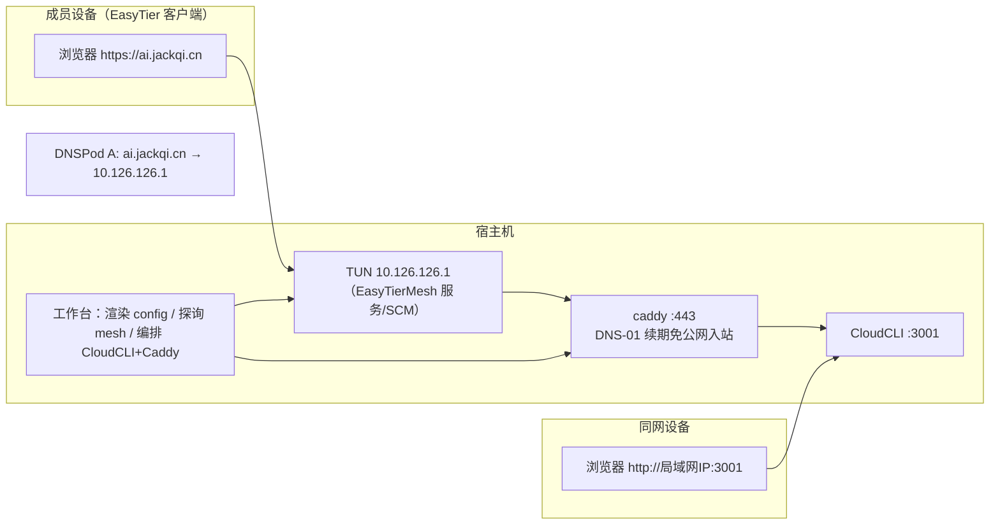

# 008-legacy-channel-removal · 技术方案（plan）

> 导航：[spec.md](./spec.md) · [tasks.md](./tasks.md) · 返回 [MOC](../MOC.md)

- **状态**: draft（随 spec 同日定稿实施）
- **关联需求**: [spec.md](./spec.md)
- **最后更新**: 2026-09-11

## 1. 方案概述

移除直连（DDNS/ddns-go）与穿透（frp/SakuraFrp）两条旧通道的全部代码、资源与真机残留，通道模型收敛为**组网单通道**；保留局域网 IP 直访（3001，sprint0 形态）与域名 HTTPS 链（Caddy + DNS-01 + 腾讯密钥，分支 A）。核心动作四件：① `AccessChannel` 单变体化 + 旧值迁移映射（持久化契约变更，ADR-0004）；② `tunnel.rs` 解体（frp 守护/切换/停用编排删除，DNS mesh 判定迁 `dns_api.rs`）；③ 前端 `TunnelCard`→`MeshCard` 适应性重构（非纯删除）；④ 一次性幂等卸载脚本 `uninstall-legacy.ps1` 清真机残留。真机执行前置闸门：007 T14 签收 + O1 闭合。

## 2. 关键决策

| # | 决策 | 理由 | 放弃的备选及原因 |
|---|------|------|------------------|
| D1 | `AccessChannel` 收敛单变体 `Mesh`，自定义 Deserialize 把 `"direct"`/`"tunnel"` 映射为 Mesh | 直接删变体会让存量 settings.json 反序列化失败→触发损坏修复（回默认丢全部设置，AC24 路径）；映射迁移零损失、下次保存规范化 | ①保留三变体仅删行为（死代码常驻、枚举匹配永假）；②启动时一次性改写文件（提前落盘时机别扭，加载时映射已足够） |
| D2 | `tunnel.rs` 整文件删除，幸存者（`DnsAlignment`/`judge_dns_mesh`）迁 `dns_api.rs` | 通道切换/停用/守护全部消亡后该文件只剩 DNS 判定，就近并入 DNS 模块；避免"通道框架"空壳文件误导后续维护 | ①改名 `channel.rs` 保留（单通道无"channel"复数语义，空壳）；②迁 `mesh.rs`（DNS 判定非 mesh 专属，dns_api 是它唯一消费语境的近邻） |
| D3 | 凭据单源化：删 `read_credential` 的 `ddns-go.yaml` 回退链 | yaml 随卸载销毁，回退链成死代码；两份副本（.env/yaml）本就存在静默漂移风险（审核发现） | 保留回退兼容旧机（旧机卸载后必然断链，留着误导） |
| D4 | 卸载编排纯脚本 `uninstall-legacy.ps1`，不做 UI 入口 | 一次性操作；003「低频外部操作给入口不代劳」哲学的极形式 | 设置页一次性按钮（用完即废的 UI，YAGNI） |
| D5 | `TunnelCard.tsx` 改名 `MeshCard.tsx` 并重构 | 007 保留旧名是为避免无谓 diff；008 本就重构此卡，一次改净 | 继续沿用（永久名不副实） |
| D6 | CNAME 残留清理复用既有 `mesh_sync_dns`（工作台入口），卸载脚本只检测+指引 | TC3 签名调 DNSPod API 的实现在 Rust（dns_api），PS 重写即重复造轮；且切 mesh 时 `sync_to_mesh` 已删过 CNAME，卸载时多为无残留 | PS 内实现 TC3 调用（重复实现 + 凭据进脚本环境） |
| D7 | 向导 `wizard_set_branch` 命令随分支概念删除 | 通道阶段去分支化后无消费方；新装机默认即 mesh（007 T3 已定），无需 patch | 保留命令仅设 mesh（无调用方死代码） |
| D8 | uninstall 前置校验 `.env` 腾讯密钥，缺且 yaml 有则拒绝（AC11） | 删 yaml 即销毁唯一凭据副本→DNS-01 续期断链；自动搬运需脚本解析/传递密钥，违背"密钥不经脚本参数/日志"边界 | 脚本从 yaml 抽取写 .env（密钥过脚本手，003 哲学不允许） |

## 3. 终态架构



移除后：frpc（spawn 守护）/ddns-go（进程+自启任务+yaml）/通道切换状态机/停用编排/穿透设置与向导分支全部消失；`COMPONENT_ORDER = [CloudCli, Caddy]`；组网服务独立于编排器（SCM 承载，007 §3.3 语义不变）。

## 4. 数据模型与迁移（settings.json）

```rust
/// 迁移映射（D1）：加载时旧值 → Mesh；"mesh" 原样；其他值报错走损坏修复
#[derive(Serialize, Deserialize)]
#[serde(rename_all = "lowercase")]
enum AccessChannel { Mesh }
// 自定义 deserialize：读字符串 → match { "mesh"|"direct"|"tunnel" => Mesh, other => Err }

struct Settings {
    access_channel: AccessChannel,   // 默认 Mesh（新装机与旧文件统一）
    mesh: MeshConfig,                // 007 交付物，不变
    // 删：tunnel: TunnelConfig / tunnel_enabled / tunnel_disabled / direct_disabled
    // ……其余字段不动
}
```

| 旧 settings.json | 新版本加载结果 |
|---|---|
| `accessChannel:"direct"` / `"tunnel"`（任意 tunnel 字段组合） | `accessChannel:"mesh"`，其余字段保留；下次保存后被删字段消失 |
| `accessChannel:"mesh"` | 原样 |
| `accessChannel:"frp"` 等异常值 | 反序列化报错 → 既有损坏修复流程（回默认+改名 .bad，AC24 口径） |
| 无 `accessChannel` 字段（004 前古董） | serde default → Mesh |

向导状态（wizard state）中的 channel branch 字段：随分支概念退役，旧值（"tunnel"/"direct"）加载时忽略（serde 忽略未知字段），向导状态机按 mesh 单线推导。

## 5. 接口契约（Tauri 命令增删）

**删除**：`get_tunnel_status`、`switch_channel`、`set_tunnel_enabled`、`restart_tunnel`、`clear_frp_key`、`get_defender_exclusion_cmd`、`download_frpc`、`disable_legacy_channel`、`wizard_set_branch`；事件 `tunnel://status` 随守护消亡。

**保留不变**：`mesh_status`/`mesh_apply_config`/`mesh_install_service`/`mesh_uninstall_service`/`mesh_sync_dns`、`start_all`/`stop_all`/`get_status`/`start_one`/`stop_one`、`get_urls`/`open_external`（DdnsAdmin kind 删）、`get_settings`/`save_settings`、`set_language`、`get_net_status`/`set_network_category`、`run_dns_probe`、`run_tool`（kind 收缩：删 `set_frp_key`/`clear_frp_key`/`reset_ddns_password`/`config_ddnsgo`）、`get_defender_exclusion_cmd` 删、心跳 `get_domain_health` 族、向导 `wizard_get_state`/`wizard_set_stage` 族。

**变更**：`check_dns_alignment` 收敛 mesh-only（Direct 分支删，`judge_dns` 直连半边删、`judge_dns_mesh` 迁 dns_api.rs）；`get_urls` 载荷不变（local/lan/domain 三行是双方案呈现载体）。

## 6. 测试策略（AC × 测试映射）

| AC | 自动化（模块内 #[cfg(test)]） | 手工（acceptance-manual.md） |
|---|---|---|
| AC1 | manifest/资源一致性由 build 流程与 T20 校验 | 全文检索走查 + 安装包内容抽查 |
| AC2 | settings 迁移单测（direct/tunnel/异常值/无字段/字段保留五态） | — |
| AC3 | orchestrator 二元组断言（既有测试改写） | 看板两卡走查 |
| AC4 | — | 组网卡呈现与入口走查 |
| AC5 | `build_urls` 既有单测回归 | 三行复制/打开走查 |
| AC6 | wizard derive mesh 单线断言（direct/tunnel 分支测试删改） | 向导端到端走查（新装机视角） |
| AC7 | — | 设置页走查 |
| AC8 | `judge_dns_mesh` 迁移回归测试 | 体检走查 |
| AC9 | scripts.rs 登记 shrink 断言 | 工具区走查 |
| AC10 | 脚本 PARSER/BOM+CRLF 校验（既有纪律） | **真机执行**（前置闸门：007 T14 签收 + O1 闭合） |
| AC11 | — | 真机构造缺密钥场景验证拒绝与指引 |
| AC12 | — | 文档核对清单 |

## 7. 风险与对策

| # | 风险 | 影响 | 对策 |
|---|------|------|------|
| R1 | settings 迁移遗漏旧值形态（tunnel 配置组合/古董文件） | 加载失败回默认丢设置 | 迁移单测五态矩阵（D1）；serde 忽略未知字段兜底 |
| R2 | 大范围删除引发连锁编译错（tunnel.rs 被 lib/commands/heartbeat 多处引用） | 中途不可编译、任务难切分 | 按依赖序拆任务（consts/probe → dns_api → tunnel 解体 → commands → wizard），每步 cargo test 收绿再进下一步 |
| R3 | 打包清单漂移（$ScriptSubset/manifest/resources 三处不同步，006 坑） | 构建产物含陈旧副本或漏删 | T20 专项校验三处一致；build.ps1 L123 自动清理陈旧副本依赖 $ScriptSubset 正确收缩 |
| R4 | uninstall 脚本误删（.env 整文件/非目标文件） | 凭据丢失 | 仅删 `SAKURA_FRP_KEY` 单行（复用 clear-frp-key 语义）、文件删除前存在性判断、幂等重跑、AC11 前置校验 |
| R5 | 真机闸门未满足即执行卸载（组网未稳而旧通道已删） | 远程访问中断且不可逆 | 闸门写入 spec §5 与验收清单；卸载脚本头部显著提示前置条件（服务在线检测） |
| R6 | 心跳/自愈视图与 TunnelManager 的耦合拆除遗漏 | heartbeat 编译错或行为漂移 | T6 解体时核 `SharedHealth` 全部消费点（审核线索：仅 TunnelManager 消费），心跳探测本体不受影响 |
| R7 | 前端 i18n 清理漏键/错删共用键（`tunnel-form-*` 被 mesh 复用） | tsc 挂或样式丢失 | 缺键即构建挂的既有纪律；`tunnel.channelMesh`/`tunnel.check.mesh` 等 mesh 共用键保留清单在 tasks T18 显式列出 |

## 8. 影响范围（审核结论索引，实施清单见 tasks.md）

**Rust**：`settings.rs`（迁移）/`consts.rs`/`probe.rs`/`stop.rs`/`lang.rs`/`urls.rs`/`orchestrator.rs`/`dns_api.rs`/`tunnel.rs`（删）/`commands.rs`/`wizard.rs`/`scripts.rs`/`autostart.rs`/`lib.rs`/`mesh.rs`（注释）/`Cargo.toml`（描述）；删 `examples/dns_sync_probe.rs`。

**资源与脚本**：删 5 文件（双份）+ `installer-hooks.nsh` + `tauri.conf.json` 引用；`setup-autostart.ps1`/`install-https.ps1` 收缩；`build.ps1` $ScriptSubset；`manifest.json` 再生成；新建 `uninstall-legacy.ps1`；`tools/sprint0`（bat/menu/README）同步。

**前端**：`types.ts`/`api.ts`/`App.tsx`/`MainView.tsx`/`TunnelCard.tsx`→`MeshCard.tsx`/`SettingsView.tsx`/`WizardView.tsx`/`ToolsSection.tsx`/`i18n/zh.ts`/`i18n/en.ts`/`app.css`。

**文档**：`docs/adr/0004`（新建）；`specs/003`/`004` 归档；`specs/MOC.md`；`CHANGELOG.md` Unreleased；`.env.example`；`docs/product.md` 路线图。

**保留项（显式）**：Caddy 全链（含 `Protect-StackDir`——easytier 目录 ACL 依赖）、`install-https.ps1` Caddy 半边、`set-tencent-key.ps1`、`run-caddy-hidden.ps1`、`enable-https.ps1`、443/3001 防火墙规则、心跳 005、网络归类 002、`tunnel-form-*` CSS（mesh 复用）。

## 变更记录

| 日期 | 变更内容 | 原因 |
|------|----------|------|
| 2026-09-11 | 初稿 | 需求方「起草，拆分，实施」指示；方案基于同日四路全仓审核与前端外观审核的结论沉淀 |
