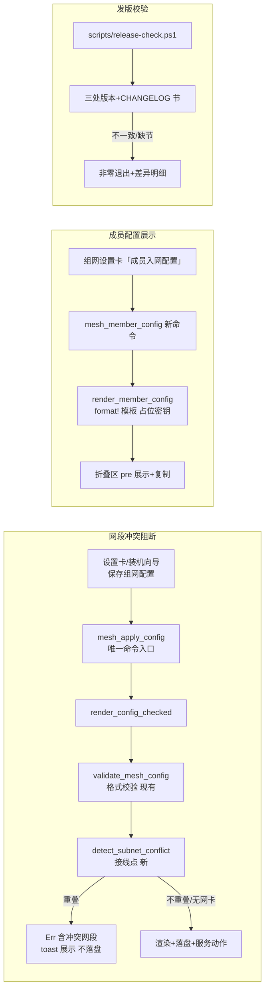

# 009-mesh-subnet-guard · 技术方案（plan）

> 导航：[spec.md](./spec.md) · [tasks.md](./tasks.md) · 返回 [MOC](../MOC.md)

- **状态**: draft <!-- draft | reviewed -->
- **关联需求**: [spec.md](./spec.md)（reviewed，US1~US4 / AC1~AC11）
- **最后更新**: 2026-09-11

## 1. 方案概述

四条线全部复用既有设施，**零新增依赖**。US1 是「接线」而非新写：spec 007 已交付的纯函数 `detect_subnet_conflict` 与生产采集 `local_ipv4_addrs()`（诊断路径在用）接入 `render_config_checked`（`mesh_apply_config` 唯一渲染入口，设置卡与装机向导都经此，AC4 天然成立），错误走既有 toast 通道。US4 在 Rust 侧新增成员视角的最小 TOML 模板渲染（占位密钥 + 行注释，`format!` 手工模板而非 serde 序列化——注释可控），新命令 + 前端折叠展示区。US2 为独立只读校验脚本 `scripts/release-check.ps1`。US3 复用随包卸载脚本，无代码。

## 2. 技术选型

| 领域 | 选型 | 理由 | 放弃的备选及原因 |
|------|------|------|------------------|
| US1 网卡数据源 | 既有 `local_ipv4_addrs()`（`list_afinet_netifas`，mesh.rs:995） | 已在诊断路径生产使用；过滤回环/IPv6 逻辑现成 | NetMonitor/probe 复用——其 `NetEntry` 无 IPv4 字段，需扩契约，改动面大 |
| US1 接线点 | `render_config_checked`（validate 之后） | 全部保存/应用路径的唯一汇聚点；格式校验先行、网段检测殿后 | 前端预检——可绕过（违背 AC4）且无法访问网卡数据 |
| US1 错误形态 | `Err(String)` 中文可读文案（含冲突网段），走现有 toast | 与 `validate_mesh_config` 既有错误形态一致 | 稳定码 + i18n 词条——现有保存错误全部为中文直接文案，单独双语化制造不一致；文案 i18n 化整体列入非目标 |
| US4 TOML 生成 | `format!` 手工模板（成员最小口径） | 需要行注释（`# 对应 App 内 xxx`），serde 序列化不产注释 | 复用 `ConfigToml` serde 结构——服务端视角（listeners/dhcp/静态 IP）不适用成员，且无法带注释 |
| US4 展示形态 | 组网设置卡内折叠区 + `<pre>` + 一键复制 | 与设置卡同域免跳转；`common.copy`/`toast.copied` 词条已有 | 独立弹窗/页面——过重；系统剪贴板已有现成通道 |
| US2 脚本 | `scripts/release-check.ps1`（PS 5.1、BOM+CRLF、T() 双语） | 与 sprint0 脚本约定一致；PowerShell 原生解析 JSON/TOML 无需新工具 | Python——仓库脚本栈统一 PowerShell；cargo 脚本——不能读 package.json 之外两处 |

> 无全局性选型，不立 ADR。

## 3. 架构设计



US1 关键决策——**TUN 自身排除**：EasyTier 服务端 TUN 的静态 IP 即 `virtual_ip`，若不排除则判据①必然命中自身（假冲突）。对策：喂入检测前剔除 `== virtual_ip` 的地址（服务端 dhcp=false，TUN IP 恒等于 virtual_ip，判据充分；不依赖网卡名——TUN 适配器名称无 SLA）。

US4 成员配置模板（官方最小口径，成员 IP 由组网 DHCP 自动分配）：

```toml
# ===== EasyTier 成员入网配置（对照移动端 App 逐项输入）=====
[network_identity]
network_name = "<已保存网络名>"        # App 内「网络名称」
network_secret = "<你的组网密钥>"      # App 内「网络密码」——填入 set-mesh-secret.ps1 设定的值

[[peer]]
uri = "<对端节点 URI>"                 # App 内「节点/对端」——每条对端填一项
# ……每个已配置对端一条
```

## 4. 数据模型

无新实体、无迁移。US1/US4 均消费既有 `MeshConfig`（network_name / virtual_ip / virtual_cidr / peers）；US4 不读 `network-secret` 文件（占位符方案，密钥不出栈目录——AC8 维持）。

## 5. 接口契约

| 契约 | 定义 | 变更类型 |
|------|------|----------|
| `render_config_checked` | `validate_mesh_config` 通过后追加网段检测；失败返回 `Err` 含冲突物理网段列表（文案：`虚拟网段 {cidr} 与本机物理网卡网段重叠（{冲突 IP 列表}），请更换虚拟网段`） | 行为收紧（既有函数，无签名变化） |
| `mesh_member_config` 命令 | `() -> Result<String, String>`（成功=完整 TOML 文本；未配置网络名/对端时 Err 提示先完成组网设置） | **新增**，注册进 `invoke_handler` |
| 前端 api | `api.meshMemberConfig(): Promise<string>` | **新增** |
| i18n 词条 | `mesh.memberConfig`（入口按钮）、`mesh.memberConfigHint`（密钥指引）等 zh/en 双侧对称新增 | **新增** |
| `scripts/release-check.ps1` | 参数 `-Version <semver>`（默认读 package.json）；退出 0=全过 / 1=任一失败；只读 | **新增**（生命周期脚本，README 同步） |

## 6. 测试策略

| AC | 覆盖方式 |
|----|----------|
| AC1/2/3 | Rust 单测（接线层，注入固定网卡列表）：重叠→Err 含冲突 IP；不重叠→Ok；空网卡列表→Ok（fail-open）。AC3 的「可观察」=空列表时检测日志行（log 途径现有） |
| AC4 | 调用链结构性保证（向导与设置卡同走 `mesh_apply_config`）+ 单测覆盖 `render_config_checked` 层；代码注释锚定 |
| AC5/6/7 | 脚本自测：对仓库真实现跑 AC5 正例；`-Version 9.9.9` 构造 AC6/AC7 负例（CHANGELOG 无该节）；临时副本可再构造版本不一致负例 |
| AC8 | 真机手工验收（需求方在场），台账回填 specs/008 acceptance-manual |
| AC9/10 | 手工验收清单（GUI 展示/复制）+ i18n 键集一致性脚本化核对（既有口径 zh/en 双向差集） |
| AC11 | Rust 单测：`toml::from_str` 将生成文本反序列化到成员结构（network_identity/peers），断言与 `MeshConfig` 字段一致——格式合规不靠肉眼 |

回归门：`cargo test`（基线 190+3，允许因新增用例增长）+ `npm run build` + 新改 ps1 的 Parser/BOM/CRLF 校验。

## 7. 风险与对策

| 风险 | 影响 | 对策 |
|------|------|------|
| 物理 IP 采集含其他 VPN TUN（ZeroTier 等）同段 → 误报阻断 | 用户无法保存 | 文案含冲突 IP 列表供用户判断；fail-open 仅限「枚举失败」，有网卡时的误报属既有双判据保守设计（spec 007 已注明）；网段可编辑是兜底出口 |
| TUN 排除判据失效（EasyTier 未来改 DHCP 分配服务端 IP） | 服务端自身假冲突 | 单测锚定「剔除 ==virtual_ip」行为；如未来出现，按变更是放宽判据（名字过滤） |
| 手机 App 字段名与注释措辞不匹配（版本差异） | 指引价值降低 | 注释按官方 App 通用字段口径（网络名称/网络密码/节点），AC9 手工验收时以真机 App 对照核对措辞 |
| release-check 解析 Cargo.toml 的 `version = "x"` 误中依赖段 | 假阴性/假阳性 | 正则锚定 `[package]` 段首个 `^version`；单测三态覆盖 |
| US3 执行时组网服务未在线或凭证缺失 | 清理中止 | 脚本既有双闸门直接拒（非本 spec 引入）；择期重跑（幂等） |

## 8. 影响范围

- **Rust**：`mesh.rs`（接线 + `render_member_config` + 单测）、`commands.rs`（新命令）、`lib.rs`（注册）
- **前端**：`MeshCard.tsx`（成员配置折叠区）、`api.ts`、`i18n/zh.ts`/`en.ts`（新增词条双侧）
- **脚本**：`scripts/release-check.ps1` 新增；`CLAUDE.md` 常用命令区补一行
- **文档**：spec 009 三文档自同步；实现完成回填 acceptance-manual；CHANGELOG Unreleased；MOC 状态流转
- **顺手项（免 spec）**：瘦身报告 P2——`heartbeat.rs:248` / `orchestrator.rs:760,822,1125` 四条 test-only 告警清理
- **不动**：`uninstall-legacy.ps1`、EasyTier 二进制、settings 结构、诊断路径 `local_nic_judge`

## 变更记录

| 日期 | 变更内容 | 原因 |
|------|----------|------|
| 2026-09-11 | 初稿 | spec 009 reviewed 后方案起草 |
