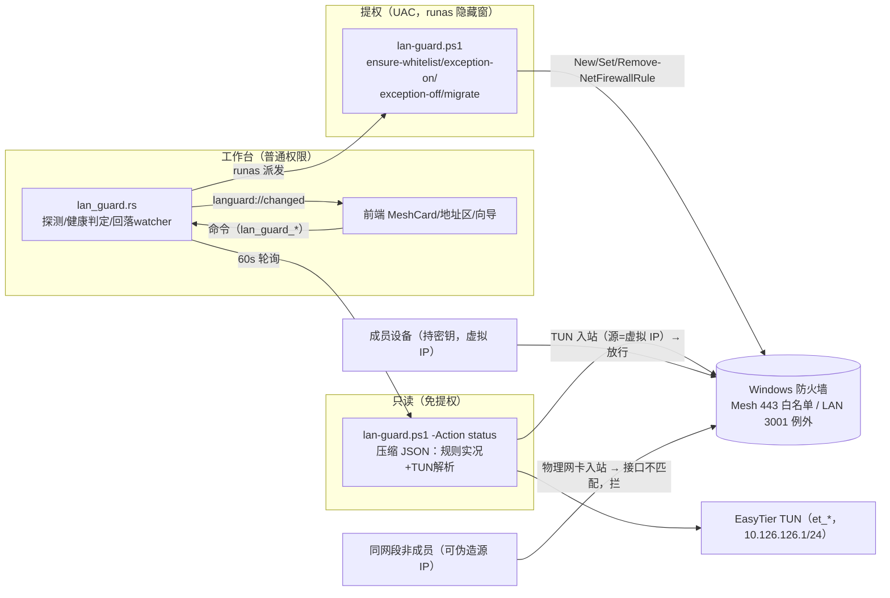

# 010-lan-boundary-hardening · 技术方案（plan）

> 导航：[spec.md](./spec.md) · [tasks.md](./tasks.md) · 返回 [MOC](../MOC.md)

- **状态**: draft <!-- draft | reviewed -->
- **关联需求**: [spec.md](./spec.md)
- **最后更新**: 2026-09-12

## 1. 方案概述

防火墙契约从「网络归类（Profile）一比特闸门」整体迁移到 **「源地址 ∈ 组网虚拟网段 + 接口 = EasyTier TUN 网卡」双条件白名单**（443 规则 Profile=Any）：到达 Caddy 的每个入站包必须从 TUN 接口进入且源 IP 落在虚拟网段，未持 network_secret 的设备在网络层不可达——伪造源 IP 的包从物理网卡进入即不匹配接口条件（spec AC1 场景），而 TUN 只有持密钥入网才可写入。3001 **删除既有放行规则**回落 Windows 默认拒绝（loopback 与 Caddy→3001 上游是本机回环流量，不受影响），局域网直访降级为显式例外开关：开启 = 以最小暴露面（Private + LocalSubnet）重建规则，开启满 12h 自动回落，回落与开关状态在看板常驻如实呈现。

工程承载三点：① 新建专用脚本 `lan-guard.ps1`（status 免提权 / ensure-whitelist / exception-on / exception-off / migrate 五动作）作为防火墙规则 CRUD 的**单点**，工作台经 ShellExecuteW runas 隐藏派发、真相以 status 复测为准（002 先例）；② 新增 `lan_guard.rs` 模块——状态探测与解析、健康判定纯函数、12h 回落 watcher、派发参数构造，架构沿 NetMonitor/MeshMonitor 既有模式；③ 002 的 443 归类告警随 Private 语义**整体退役**（告警对象消亡），网络归类**调整**入口保留继续服务例外场景。装机脚本（enable-https.ps1 / install-server.ps1）改为产出新契约或不再创建规则，存量真机经启动自检 + 「一键收口」显式迁移（幂等：删两条旧规则 → ensure-whitelist）。规则契约变更 + 002 告警退役立 ADR-0005。

**T1 前置取证（2026-09-12 本机实测，开放问题关闭）**：①TUN 接口 = `et_8_1999`（InterfaceDescription=`Tunnel`，Wintun Userspace Tunnel 0.14.0.0，ifIndex 60，InterfaceType=53/propVirtual），虚拟 IP `10.126.126.1/24` 挂载为单一 IPv4——接口名为 wintun 按实例生成（`et_*` 后缀随实例变），**不可作为契约常量**，规则绑定走运行期解析（§3.3）；②`CloudCLI LAN HTTPS 443` 与 `CloudCLI LAN 3001` 实测均 **Profile=Private**、RemoteAddress=Any、InterfaceAlias=Any——007 acceptance-manual O1 记录的 443 Profile=Any 漂移在当前真机**不可复现**（推测规则在其后被重装流程重建过），漂移风险类别随 Profile 语义退役而消亡，留档见 §7-R2；③本机 loopback 不受任何规则影响（默认放行），Caddy→3001 上游（127.0.0.1）同此。

## 2. 技术选型

| 领域 | 选型 | 理由 | 放弃的备选及原因 |
|------|------|------|------------------|
| 443 白名单机制 | Windows 防火墙规则 `-RemoteAddress <CIDR>` × `-InterfaceAlias <TUN>` 双条件（NetSecurity cmdlet） | 网络层唯一闸门，零应用层改动（Caddy/CloudCLI 不动）；双条件 AND 是防火墙过滤器原生语义；伪造源 IP 从物理网卡进入即不匹配（AC1） | ①应用层认证（spec §2 非目标：爆破面/凭证分发成本，不满足「不可达」性质）；②WFP 自研 callout（开发量与风险不成比例）；③仅源网段单条件（可被同网段 alias 伪造绕过——spec 变更记录 2026-09-12 复审结论） |
| TUN 接口绑定 | **运行期解析**：以「持有 `virtual_ip` IPv4 的适配器」为语义锚点解析 InterfaceAlias，健康自检持续核对规则与实况 | 真机实测接口名 `et_8_1999` 为 wintun 按实例生成，服务重装/驱动升级后不保证复用同名——固定名是伪契约 | ①固定接口名常量（伪契约，见取证①）；②`-InterfaceType Tunnel`（接口类型 53 与防火墙 Tunnel 枚举的映射未实证，且规则只读无法验证；留作后续备选）；③接口 GUID（防火墙规则过滤器不支持 GUID 形态） |
| 规则 CRUD 载体 | 新建专用 `lan-guard.ps1`（五动作、幂等、双语、自检管理员），工作台 runas 隐藏派发 | 单点承担全部规则操作：装机脚本/向导/迁移/例外/联动全部收敛到同一契约，无双源漂移；006/008「脚本单职责 + 双目录同步」惯例 | ①塞进 enable-https.ps1/install-server.ps1（装机时点与 TUN 就绪时序错位，且职责混杂）；②程序内 NetFw COM API（引入 COM 依赖，偏离既有 PS 脚本栈） |
| 派发与回执 | ShellExecuteW runas + `-WindowStyle Hidden`，**fire-and-forget，真相以 status 复测为准**（002 set_category_params 先例）；提权窗进程无法回传 stdout，退出码契约仅用于命令行手工排查 | 提权隐藏窗 + 复测是项目已验证的模式（002 AC5~AC7 语义完整复用：批准→生效→复测刷新；拒绝→code 5→Err 提示不崩溃） | 捕获提权进程 stdout（ShellExecuteW 无管道语义，需落盘中转文件，引入时序与清理负担，不值） |
| 12h 回落承载 | 工作台内 watcher 线程（60s tick）+ **应用启动补回落**；到期回落动作走 UAC（失败重试 + 看板如实显示仍放行） | 规则删除需管理员而工作台常驻普通权限——到期时的 UAC 弹窗在例外开启时的风险说明中预先告知；服务（SYSTEM）不是规则管理的职责方 | ①计划任务承载回落（004 踩过任务结束杀子进程坑，且又多一个提权面）；②easytier 服务内嵌（组件职责混杂，service 侧无 settings 访问） |
| 状态探测 | PowerShell 单次调用输出压缩 JSON（规则实况 + TUN 解析），UTF8 输出编码 | network.rs `detect_args` 同款先例（15s→60s 降频：健康态无需告警级实时性，摊薄 PS 拉起成本）；免提权只读 | 常驻 WMI 订阅（复杂度不值）；拆多次进程调用（拉起成本翻倍） |
| 002 告警去留 | **443 归类告警整体退役**（needs_alert/告警条删除），网络归类**调整**入口（002 US2）保留；「公用网络下例外不生效」改为白名单健康态的一个提示位 | 告警的判定对象（Private 语义的 443 规则）被本 spec 消灭，保留即恒不触发的死代码；008 先例——承载对象退役的功能随对象消亡（003/004 归档同源逻辑）；例外 × 公用网络的组合提示挂在健康判定纯函数上更内聚 | 保留告警并改写为「白名单健康告警」（两套探测/两套轮询重复建设，且白名单健康本就有常驻展示位）；002 spec 状态不动（done 不回退），退役注记走其变更记录 + CHANGELOG（T8） |

## 3. 架构设计

### 3.1 数据流与派发拓扑



要点：

- **规则操作与组网服务解耦**（spec §4 失败语义）：lan-guard 任一动作失败不触碰 easytier 服务，失败经健康态如实上报。
- **一条规则家族**：新契约仅两条规则（443 白名单 + 3001 例外），名字即契约（Rust 常量 + 脚本内一致）。
- 例外规则面向**物理局域网**（Profile Private + RemoteAddress LocalSubnet，无 TUN 条件）；白名单规则面向**组网**（Profile Any + RemoteAddress CIDR + InterfaceAlias TUN）。

### 3.2 防火墙规则契约（定稿）

| 项 | 443 白名单（新） | 3001 例外（新，默认不存在） | 旧规则（退役，迁移删除） |
|---|---|---|---|
| DisplayName | `CloudCLI Mesh HTTPS 443` | `CloudCLI LAN 3001 Exception` | `CloudCLI LAN HTTPS 443` / `CloudCLI LAN 3001` |
| 方向/协议/端口 | Inbound TCP 443 | Inbound TCP 3001 | 同左 |
| Action | Allow | Allow | Allow |
| Profile | **Any**（创建时不传 -Profile） | **Private** | Private |
| RemoteAddress | `<mesh.virtual_cidr>`（默认 10.126.126.0/24，随设置联动） | `LocalSubnet`（严格于旧规则的 Any，精确落地「同网段设备」语义） | Any |
| InterfaceAlias | 运行期解析的 TUN 接口名（§3.3） | 不限定 | 不限定 |
| 创建方 | lan-guard ensure-whitelist / migrate | lan-guard exception-on | （已废除）enable-https.ps1 / install-server.ps1 |

命名理由：443 沿「CloudCLI <域> <端口>」家族式命名，`Mesh` 表达组网域；例外名含 `Exception` 与旧规则名明确区分——**旧规则检测（精确名匹配）与例外态检测（新名）互不歧义**，迁移与开关状态都是纯函数可判定。弃用备选：例外复用旧名 `CloudCLI LAN 3001`（省一个名字，但升级时「旧规则残留」与「例外开着」无法区分，状态机凭空多一个歧义分支）。

幂等语义（脚本侧）：ensure-whitelist 先解析 TUN → 已存在且 RemoteAddress/InterfaceAlias 均匹配 → 跳过；存在但不匹配或不存在 → Remove（若在）+ New（删除窗口期防火墙默认拒绝，方向安全不产生暴露）。exception-on 同形幂等；exception-off 仅 Remove（不存在亦成功）。

退出码契约（脚本，供手工命令行排查；工作台侧不依赖，以复测为准）：0 成功/幂等跳过；1 前置不满足（非管理员/参数非法）；3 TUN 接口未解析到（`-WaitTun` 等待耗尽，不创建规则——组网不在时成员本就无 TUN 路由，规则缺失不构成暴露，属「休眠」而非异常）。

### 3.3 TUN 接口解析与失配修复

- **解析判据**：`Get-NetIPAddress -AddressFamily IPv4` 中 IPv4 == `-VirtualIp` 入参的适配器（虚拟 IP 是语义锚点——无论 wintun 起什么名，持有它的就是 TUN）。解析在脚本内完成（规则生效时点的实况），Rust 侧不解析接口名。
- **失配场景**：服务重装/驱动升级重建适配器（改名）、用户改 virtual_ip 未应用、规则被外部工具改动 → 规则 InterfaceAlias/RemoteAddress 与实况不符。失配 = **fail-closed**（规则匹配不到任何流量，成员不可达但零暴露），健康自检（§3.5）标 `stale_iface`/`stale_cidr`，MeshCard 横幅给「修复白名单」显式按钮（单动作 ensure-whitelist，一次 UAC）。
- **不自动弹 UAC**：启动/轮询发现失配只提示不派发——无用户手势的 UAC 弹窗是惊吓；例外开关与迁移按钮本就是用户手势，天然无此问题。

### 3.4 例外开关状态机（12h 回落）

设置持久化（§4）+ 规则实况双源，状态判定为纯函数（`judge_health`，单测覆盖全分支）：

| exception_enabled | exception_since | 规则实况 | 呈现态 | 动作 |
|---|---|---|---|---|
| false | — | 无 | off（默认） | — |
| false→true（点击开启） | 派发成功后写 now | 创建中→有 | on（剩余时长 = 12h − (now−since)） | 风险说明确认 → UAC；拒绝 → **不写设置、状态原样**（AC7） |
| true | 未满 12h | 有 | on | watcher 每分钟核对剩余 |
| true | 满 12h | 有 | **expired（回落中）** | watcher 立即 UAC 派发 exception-off；**拒绝/失败 → 每 30min 重试 + 看板显示「已到期仍放行」**（回落失败必须重试且如实显示，AC8） |
| true | 满 12h | 无（已被外部删/上次已删成） | — | **免 UAC**：本地清 exception_enabled 即可（规则已不存在，删除无对象） |
| true | 任意 | 无（派发成功但规则未生效/被中途删） | pending（「例外已请求但规则未生效」） | 引导重新开启（重新派发） |
| 应用退出期间到期 | — | 有 | 下次启动**先补回落** | 启动自检发现 enabled ∧ expired ∧ 规则在 → 立即 UAC 派发；在补回落完成前地址区局域网行按「回落未完成」如实呈现（不阻塞 UI） |

- 开启时 UAC 弹窗与 12h 后回落 UAC 均在开启时的风险说明中**预先告知**（「回落时将再次请求管理员权限」）。
- 关闭开关 = UAC 派发 exception-off → 复测确认后清设置标记；UAC 拒绝 → Err 提示、状态原样（AC7）。
- 开关仅影响 3001；443 无例外通道（永远只走白名单，spec §4）。

### 3.5 白名单健康自检与联动

- **探测**：`lan_guard.rs` 的 LanGuardMonitor（NetMonitor 同构：probe/sink/缓存/变化才发声 `languard://changed`），60s 轮询 status（只读免提权），外加动作后即时刷新（派发/开启/关闭/迁移完成即刻复测）。
- **健康判定 `judge_health`（纯函数）** 输入 = status JSON + mesh 设置（cidr）+ 例外标记 + 活动网络归类（NetMonitor 现有 networks）+ now，输出：

```rust
struct LanHealth {
    whitelist: WhitelistState,  // ok | missing | stale_cidr | stale_iface | dormant(TUN缺)
    legacy_present: bool,       // 任一旧规则存在 → 迁移横幅（AC10）
    exception: ExceptionState,  // off | on{remaining_secs} | expired | pending
    public_blocks_exception: bool, // 例外生效 ∧ ∃公用活动网络（如实提示：直访不生效）
}
```

- **联动时序（AC9，唯一变更入口）**：`mesh_apply_config` / `mesh_install_service` 在 `prepare_mesh_stack`（渲染 + validate + 009 网段冲突检测）**通过后**，把「服务动作 + lan-guard ensure-whitelist」**合并为一次提权派发**（同一可见脚本窗顺序执行、一次 UAC；白名单段失败不回滚服务段）。合并理由：改网段必然伴随「应用」动作（AC9 的唯一入口），合并消双弹窗；TUN 未就绪由 `-WaitTun 20` 缓冲（服务重启后适配器就绪窗口）。**`save_settings` 不联动**——009 的网段校验在渲染时点，裸保存未经校验，若在保存时点刷白名单会把被阻断的网段先写进规则（违背 AC9「被阻断时白名单不变」）。
- 呈现位置：MeshCard 新增「访问白名单」行（健康态 chip + 例外开关 + 剩余时长 + 失配修复按钮 + 旧规则迁移横幅）；地址区「局域网」行按 off/on/expired 三态如实措辞（AC5/AC6/AC8）。60s 慢轮询 + 动作后即时刷新，不做 5s 级实时（PS 拉起成本不值）。

### 3.6 002 退役边界（spec 开放问题 Q2 定案）

- **退役**：`network.rs` 的 `needs_alert`、NetStatus 的 `rule_present`/`rule_private_only`/`alert` 字段、detect_args 中防火墙规则段（探测收缩为纯 `Get-NetConnectionProfile`）、15s 告警轮询降为 networks 供数（60s）；前端主界面网络卡的告警条与 `net.alert` 等死键。
- **保留**：网络环境卡的逐网络行 + 设为专用/公用（002 US2）——例外开启期间用户仍需要归类调整能力；「公用网络下例外不生效」由 `public_blocks_exception` 在白名单健康区提示（数据源同 networks，不再需要独立告警通道）。
- **AC 语义对照（002 历史验收不回退）**：002 AC1~AC4 验证过的「Private 规则 × 公用网络 → 提示」行为，其规则对象被本 spec 消灭——沿 008 先例（003/004 功能随组件退役、spec 归档），US1 告警随对象消亡，002 spec 状态不动（done），退役注记记入其变更记录 + CHANGELOG（T8 执行）；002 AC5~AC8（归类调整）继续有效由保留的 US2 承载。AC4（本 spec）的「不再误报/漏报」由告警链不存在直接满足（自动化：退役后无 needs_alert 即无告警分支可触发）。

### 3.7 升级迁移与装机路径（spec 开放问题 Q3 定案）

- **存量机（升级）**：启动自检（只读 status）发现旧规则 → MeshCard 横幅「检测到旧版局域网放行规则」+「一键收口」→ UAC 派发 `migrate`（幂等：删 `CloudCLI LAN HTTPS 443` + `CloudCLI LAN 3001` → ensure-whitelist）；向导收尾页同步一个检查项/入口（同一命令）。迁移前后规则清单比对进真机验收清单（AC10）。
- **新装机**：`install-server.ps1` **删除**防火墙步与网络归类步（3001 收死、归类不再服务任何规则）；`enable-https.ps1` 步骤 1 改为调同目录 `lan-guard.ps1 ensure-whitelist`（TUN 未就绪则按退出码 3 跳过并提示——装机时序 HTTPS 阶段早于组网阶段，白名单在向导「应用」的组合派发时点就位）、步骤 2（全网络改专用）**删除**（不再服务任何规则；归类调整回归 002 US2 用户自主入口）；向导基础阶段「局域网可达」文案改如实措辞（T6）。
- **全仓收敛口径（AC10）**：实现完成后 `grep` 检索——旧规则名的创建逻辑（`New-NetFirewallRule` × 旧名/`-Profile Private` × 443/3001）全仓仅存在于 lan-guard.ps1 的 remove-legacy 删除清单与 Rust 的旧规则检测常量；`install-client.ps1` 排障提示、`menu.ps1` 局域网行文案同步改如实措辞。

## 4. 数据模型

### 4.1 settings.json 扩展（camelCase，serde default 向后兼容）

```rust
struct Settings {
    // ……既有字段不动
    lan_guard: LanGuardSettings,   // #[serde(default)]
}
struct LanGuardSettings {
    exception_enabled: bool,   // 默认 false（旧文件缺字段 → false）
    exception_since_ms: u64,   // 例外开启时点（ms epoch）；0 = 未开启
}
```

- 补丁合并：`SettingsPatch.lan_guard: Option<LanGuardSettings>` 整块写入（mesh 同款）；`exception_since_ms` 由后端在派发成功后写入，前端不直写时间戳（只提交开关意图）。
- 时间计算纯函数：`exception_expired(now, since, ttl=12h)`、`exception_remaining_secs(now, since)`（边界：`now-since == 12h` 即到期）。

### 4.2 status 探测 JSON 契约（lan-guard.ps1 -Action status，压缩输出）

```json
{"legacy443":true,"legacy3001":false,
 "mesh443":{"present":true,"remote":"10.126.126.0/24","iface":"et_8_1999","profile":0},
 "exc3001":{"present":false,"profile":2},
 "tun":{"name":"et_8_1999","ip":"10.126.126.1"}}
```

- `tun` = 持有 `-VirtualIp` 的适配器（null = 未解析到，休眠态）；`profile` 沿 002 实测 flags（0=Any/1=Domain/2=Private/4=Public），仅作展示与例外规则的 Private 断言，**不参与白名单判定**（白名单健康 = present ∧ remote==cidr ∧ iface==tun.name 三元比对）。
- UTF8 前缀 + ConvertTo-Json -Compress（network.rs 契约同款，中文网络名/接口名防乱码）。

## 5. 接口契约

### 5.1 lan-guard.ps1 动作契约（新增，双目录同步 + build.ps1 $ScriptSubset 登记）

| 动作 | 参数 | 提权 | 行为 |
|---|---|---|---|
| `status` | `-VirtualIp <ip>` | 否 | 输出 §4.2 JSON；幂等只读 |
| `ensure-whitelist` | `-Cidr <cidr> -VirtualIp <ip> [-WaitTun <sec>=0]` | 是 | §3.2 幂等契约；TUN 未解析 → 等待 WaitTun 秒后仍无 → exit 3 不建规则 |
| `exception-on` | — | 是 | 创建/刷新 `CloudCLI LAN 3001 Exception`（Private + LocalSubnet） |
| `exception-off` | — | 是 | 删除该规则（不存在亦成功） |
| `migrate` | `-Cidr <cidr> -VirtualIp <ip>` | 是 | 删两条旧规则（幂等）→ ensure-whitelist 逻辑复用 |

脚本惯例：BOM + CRLF、`-Lang zh|en` 双语 T()、管理员自检 + 拒绝提示（enable-https.ps1 先例）、单引号字面量转义（含空格路径/参数安全）。

### 5.2 Tauri 命令（新增，lib.rs 注册）

| 命令 | 入参 | 出参/行为 | 提权 |
|---|---|---|---|
| `lan_guard_status` | — | 即时探测一次（成功刷新监视器缓存并去重发声）→ `LanHealth`；失败回上次缓存，无缓存 → 探测失败态 | 否 |
| `lan_guard_set_exception` | `on: bool` | on：UAC 派发 exception-on → 成功后持久化 `{enabled:true, since:now}`；off：UAC 派发 exception-off → 复测无规则后持久化 enabled:false。UAC 拒绝（code 5）→ Err，设置不写（AC7） | 是（内部） |
| `lan_guard_migrate` | — | UAC 派发 migrate（横幅「一键收口」/向导收尾消费） | 是（内部） |
| `lan_guard_ensure_whitelist` | — | UAC 派发 ensure-whitelist（健康失配「修复白名单」按钮消费） | 是（内部） |

既有命令变更：`mesh_apply_config` / `mesh_install_service` 的提权派发参数改为「服务动作 + ensure-whitelist」组合串（§3.5，单 UAC 单窗；渲染/校验失败路径不变——不过 prepare 校验则整个不派发）；`get_settings`/`save_settings` 随 Settings 扩展自动携带 lan_guard 字段。装配层：LanGuardMonitor manage + spawn（启动时先跑补回落自检逻辑再进轮询）。

### 5.3 前端契约

- `types.ts`：`LanHealth`（whitelist/exception/legacyPresent/publicBlocksException/remainingSecs）。
- `MeshCard.tsx`：新增「访问白名单」折叠行——健康 chip（正常/休眠/待修复：stale_cidr/stale_iface/missing）、旧规则迁移横幅 + 「一键收口」、例外开关（风险确认模态：同网段零认证直访 = 潜在宿主机 shell、仅限信任网络应急、12h 自动回落且回落时会再弹管理员确认）+ 剩余时长展示 + 失败 toast。
- `MainView.tsx` 地址区：局域网行三态措辞（off：「不可直访（已收口）· 经域名/组网访问」；on：「临时放行中 · 剩余 Xh」；expired：「已到期，回落未完成」）；网络环境卡移除告警条（归类行与设为专用/公用保留）。
- `WizardView.tsx`：收尾页加白名单/旧规则检查项（消费 lan_guard_status，含「一键收口」）；基础阶段「局域网可达」表述改「本机服务就绪（局域网直访默认已收口）」如实措辞。
- i18n：`languard.*` 键族 zh/en 同步新增，`net.alert` 等退役键删除（缺一即构建挂，既有纪律）。

## 6. 测试策略（AC × 测试映射）

| AC | 自动化（模块内 #[cfg(test)]，沿既有惯例） | 手工（真机验收清单，§6.1） |
|---|---|---|
| AC1 | ensure-whitelist 派发参数断言（含 -Cidr/-VirtualIp 转义与 -WaitTun）；judge_health：iface 失配/远端网段失配 → 非 ok；status 解析契约 | 清单 1（伪造源 IP）+ 2 + 3 |
| AC2 | — | 清单 4 |
| AC3 | 契约断言：白名单规则 RemoteAddress=CIDR 非 Any（loopback 不受牵连的构造性证明） | 清单 5 |
| AC4 | 退役断言：network.rs 无 needs_alert/告警分支；judge_health 不读 Profile 判定白名单 | 清单 6 |
| AC5 | 地址区三态措辞映射纯函数（health → i18n 键） | 清单 7（off 态查看） |
| AC6 | set_exception 参数构造/持久化时序断言（派发成功才写 since；拒绝不写）；exception-on 参数断言（Private + LocalSubnet + 无 TUN 条件） | 清单 7（开/关 + 风险确认 + UAC） |
| AC7 | UAC 拒绝路径：code 5 → Err、设置原样（单测沿 shell_error_text 先例）；judge_health 待命/失败态 | 清单 7（拒绝分支） |
| AC8 | `exception_expired` 边界（==12h 即到期）与 `remaining_secs`；回落决策矩阵（§3.4 表全分支）；回落派发参数断言 | 清单 7（回填 exceptionSince 加速观察） |
| AC9 | 组合派发构造断言：prepare 校验失败 → 不含 ensure-whitelist 段；通过 → 服务动作 + ensure-whitelist 同窗顺序；judge_health stale_cidr | 清单 8 |
| AC10 | migrate 参数断言（删两条旧名 + ensure）；旧规则检测解析（legacy443/legacy3001）；全仓检索（grep 完成标志） | 清单 9 + 10 |

### 6.1 真机手工验收清单（需求方在场；不采信宿主机本机探测——004/007 口径）

1. **伪造源 IP 探测（AC1 关键场景）**：另一同网段设备将自身物理网卡附加虚拟网段地址（`netsh interface ipv4 add address "<网卡>" 10.126.126.99 255.255.255.0`）→ 探测宿主机局域网 IP 的 3001 与 443：均不可达；撤销附加地址。接口限定使伪造包从物理网卡进入即不匹配。
2. **非成员常规探测**：同网段非成员设备直探 3001/443 均不可达（默认拒绝 + 规则不匹配）。
3. **成员异网**：成员设备（蜂窝/异 WiFi）经 `https://ai.jackqi.cn/` 访问正常（源=虚拟 IP，命中白名单）。
4. **成员同 WiFi 不换网**：经域名访问正常（AC2，与网络归类无关）。
5. **本机 loopback**：`http://127.0.0.1:3001` 与工作台本机看板照常；宿主机浏览器经域名访问照常（Caddy→3001 上游不受影响）（AC3）。
6. **网络切换/归类**：WiFi⇄热点（新网络默认公用）后成员经域名仍可达；主界面无旧「网络归类」告警条（AC4）。
7. **例外开关全程**：off 态地址区措辞 → 开启（风险确认 + UAC）→ 非成员设备 `http://<ip>:3001` 可达（专用网络）→ 关闭立即不可达 → UAC 拒绝分支（状态原样、明确失败提示）→ 回落：手工回填 settings 的 exceptionSince 至 12h 前，观察自动回落 + 看板「已到期」如实呈现；回落 UAC 拒绝 → 显示仍放行且按 30min 重试（AC5/AC6/AC7/AC8）。
8. **网段联动**：设置区改 virtual_cidr（合法且不冲突）→ 应用（单 UAC）→ 规则 RemoteAddress 更新为新网段、成员（新网段静态 IP）可达；改冲突网段 → 被 009 检测阻断且规则不变（AC9）。
9. **存量迁移**：升级前 `Get-NetFirewallRule` 留底（含两条旧规则）→ 部署本版本 → 启动横幅出现 → 一键收口（UAC）→ 旧规则消失、`CloudCLI Mesh HTTPS 443` 就位（参数比对）；向导收尾页同入口复验（AC10）。
10. **白名单健康**：重命名 TUN 适配器（模拟漂移）→ 健康态转 stale_iface + 横幅 → 修复按钮恢复；停止组网服务 → dormant（休眠非异常）（AC1/AC9 健康面）。

## 7. 风险与对策

| # | 风险 | 影响 | 对策 |
|---|------|------|------|
| R1 | **TUN 接口名漂移**（服务重装/驱动升级重建适配器，wintun 按实例命名——取证①实锤） | 规则 InterfaceAlias 失配 → 成员不可达（fail-closed，零暴露但可用性受损） | 运行期解析不依赖固定名；健康自检比对 iface 失配 → 横幅 + 修复按钮；apply 组合派发天然重建 |
| R2 | 007 O1 记录的 443 Profile=Any 漂移（2026-09-12 复验**不可复现**，实测双规则均 Private——推测规则其后被重装流程重建） | 历史结论与现状不符，误导排查 | 留档本 plan；Profile 语义随本 spec 整体退役，该风险类别消亡（新契约唯一闸门是白名单三元组，Profile 仅剩例外规则的 Private 断言） |
| R3 | 隐藏提权窗无回执（UAC 批准后脚本静默失败，用户以为已生效） | 状态与实况脱节 | 真相以 status 复测为准（002 先例）；动作后即时刷新 + 健康常驻；脚本退出码契约供命令行手工排查 |
| R4 | apply 组合派发时 TUN 未就绪（服务重启后适配器就绪有延迟） | ensure-whitelist 解析不到接口 → exit 3 | `-WaitTun 20`（2s×10 轮询）；仍失败 → 休眠/横幅兜底（组网未就绪时规则缺失不构成暴露） |
| R5 | 例外开启但当前网络为公用（Private 规则不生效） | 用户以为放行了实际不通 | `public_blocks_exception` 健康提示位 + 002 US2 归类调整入口保留（用户自主改专用） |
| R6 | 多网卡宿主机 LocalSubnet 覆盖每个接口的本地子网 | 例外放行面比「单一同网段」宽 | 比旧规则 Any 严格得多且精确落地「同网段」语义；例外本身是显式开关 + 12h 回落，风险可接受（spec §3 US2 语义内） |
| R7 | 002 告警退役的用户习惯回退（曾依赖换网提示） | 反馈「提示不见了」 | CHANGELOG 明确说明 + 网络环境卡归类调整保留 + 白名单健康区承接例外场景的公用提示（§3.6） |
| R8 | 例外标记与规则实况漂移（外部删规则/设置损坏） | 状态机误判 | 判定永远以规则实况为准（enabled ∧ 无规则 → pending 免 UAC 清标记路径，§3.4）；设置损坏走既有回默认流程（例外态丢失 = 收紧方向，安全） |
| R9 | 打包漂移（新脚本漏登记——006/008 前科） | 分发副本缺 lan-guard.ps1，全部规则动作禁用 | T2 完成标志含 $ScriptSubset 登记 + 双目录哈希一致 + manifest 刷新；T9 手工清单用安装版产物复核 |

## 8. 影响范围

**Rust（apps/workbench/src-tauri/）**：新增 `lan_guard.rs`（契约常量/探测参数与解析/健康判定/回落 watcher/派发参数构造/启动补回落）；`settings.rs`（LanGuardSettings + patch 扩展）；`mesh.rs`（apply/install 派发参数追加 ensure-whitelist 段——构造函数在 lan_guard.rs，mesh.rs 只拼装）；`network.rs`（告警链退役：needs_alert/NetStatus 字段收缩/detect_args 收缩/轮询降频 60s）；`commands.rs`（四个 lan_guard_* 命令 + apply 联动）；`lib.rs`（命令注册 + LanGuardMonitor 装配）；`urls.rs` 不动（地址区三态措辞由前端按 LanHealth 组装）。

**脚本（tools/sprint0/bin ↔ resources/bin 双目录 + 打包登记）**：新增 `lan-guard.ps1`；`enable-https.ps1`（步骤 1 改调 lan-guard、步骤 2 删除）；`install-server.ps1`（步骤 5 防火墙 + 步骤 6 归类删除，步骤重编号）；`install-client.ps1`（排障提示文案）；`menu.ps1`（局域网行如实措辞）；`scripts/build.ps1` $ScriptSubset + resources/bin/manifest.json 同步刷新。

**前端（apps/workbench/src/）**：`MeshCard.tsx`（白名单健康区/例外开关/迁移横幅）、`MainView.tsx`（地址区三态 + 告警条移除）、`WizardView.tsx`（收尾页检查项 + 基础阶段文案）、`SettingsView.tsx`（组网卡保存后的既有 apply 流不变，无新增）、`types.ts`、`api.ts`、`i18n/zh.ts` + `en.ts`。

**文档与配置**：新增 `docs/adr/0005-firewall-whitelist-contract.md` + `docs/adr/README.md` 索引；`specs/002-network-profile/spec.md` 变更记录追加 US1 退役注记（状态不动）；`specs/010-.../spec.md` 开放问题回填（Q1/Q2/Q3/Q5 已决，引用本 plan 章节）；`specs/MOC.md`（010 状态流转）；`CHANGELOG.md` Unreleased（Added/Changed/Removed）；根 README「远程访问方案」段与 `tools/sprint0` README 脚本清单。

## 变更记录

| 日期 | 变更内容 | 原因 |
|------|----------|------|
| 2026-09-12 | 初稿 | spec 010 reviewed 后按六步工作流出方案与拆解；T1 前置取证三项实测（TUN 接口形态/规则 Profile 复验/虚拟 IP 挂载）关闭 spec 开放问题 Q1/Q5，Q2/Q3 于 §3.6/§3.7 定案 |
