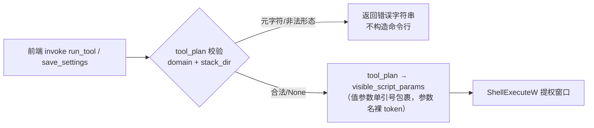

# 011-attack-surface-hardening · 技术方案（plan）

> 导航：[spec.md](./spec.md) · [tasks.md](./tasks.md) · 返回 [MOC](../MOC.md)

- **状态**: reviewed
- **关联需求**: [spec.md](./spec.md)
- **最后更新**: 2026-09-13（双子代理评审修订版）

## 1. 方案概述

四个交付面共用一个原则：**在不动 spec 010 网络边界的前提下，给「边界后零认证」的事实补纵深**。P1 在 Rust 派发层（`scripts::tool_plan`）对 `domain` 与 `stack_dir` 双字段白名单校验，并在拼接 sink 对值参数统一单引号包裹（评审修正：stack_dir 与 domain 同走裸拼通道，只修其一链路仍活）；P2 走方案 A（URL 锁核心版本 + SHA256 下载校验，字节可复现性不过关当次切 B）；P3 用 caddy 原生 basic_auth 的**多账号形态**——工作台设置区「访问账号」界面**发起与展示**、实际执行者为派发的可见窗交互脚本（需求方 2026-09-13 两次拍板：多账号 + 工作台不接触密码），事实来源为栈目录 `auth-accounts.json`（仅 bcrypt 哈希），Caddyfile 标记段由其再生（不走 .env/环境变量——三条 caddy 启动路径注入链不覆盖，空哈希会拒启），`caddy reload` 零停机生效；升级脚本独立于安装包（tools/），把「版本号/哈希/内置二进制/测试」四个手工动作收敛为一条命令。

## 2. 技术选型

| 领域 | 选型 | 理由 | 放弃的备选及原因 |
|------|------|------|------------------|
| P1 输入校验 | `tool_plan` 派发纯函数 + `normalize_stack_dir`/`save_settings` 源头双闸（domain + stack_dir 双字段白名单） | 前端被攻破时校验依然生效；写入即拒使脏值不落 settings | 只校验 domain：评审证实 stack_dir 同通道注入（settings.rs:381-386 前端可写、normalize 无字符校验），修一半链路仍活 |
| P1 参数包裹 | `visible_script_params` 对**值参数**PS 单引号字面量包裹（`'` 翻倍）；参数名 token 不包裹 | sink 处一处修改受益于全部调用方（lan_guard.rs:105-107 同款先例）；引号包裹参数名会被 PowerShell 绑定为位置实参（如 `'-Update'` 进 `$StackDir`），故分轨 | 全部 token 包裹：破坏开关参数绑定；只靠源头校验：纵深少一层 |
| P1 SHA256 | `prepare_stack` 内无条件 `verify_easytier_binaries` | 毫秒级成本换「预置恶意 exe」链路失效 | 校验缓存：apply 低频，缓存徒增状态 |
| P1 CSP | `default-src 'self'` + `script-src 'self'` + `style-src 'self' 'unsafe-inline'` + `connect-src 'self' ipc: http://ipc.localhost` | Tauri 2 编译期自动为注入脚本补 nonce/hash（官方文档）；前端全仓无运行时 fetch/WS/EventSource（评审全量核查），指令集够且不过紧 | 更紧指令集：先保功能回归；dev HMR 受拦时走 `devCsp` 加 `ws://localhost:5173`，不动生产 csp |
| P2 Caddy 锁定 | 方案 A：URL 加版本参数 + 脚本内置 SHA256 + **校验严格先于落位** | 不破坏 ADR-0003 在线构建路线；失败方向安全（拒装而非装错） | 方案 B（随包内置 +40MB）：A 的版本参数/可复现性验证失败时当次切换，不首选 |
| P3 认证 | caddy `basic_auth` 多账号（哈希内联 Caddyfile 标记段，由 auth-accounts.json 再生） | 全链路唯一咽喉一处生效；浏览器原生弹窗；bcrypt 不可逆；多账号可单独吊销 | mTLS：证书分发成本高；改 CloudCLI：第三方不可维护 |
| P3 哈希存储 | 内联 Caddyfile 标记段 | 消灭环境变量注入依赖：工作台托管（scripts.rs:290-298 仅腾讯双钥）、自启链（run-caddy-hidden.ps1:29 白名单正则）、菜单直启（menu.ps1:94 无注入）三条路径均无新变量，`{$VAR}` 空值展开 = adapt 报错 = caddy 拒启 443 全断（评审阻塞项） | .env + `{$VAR}`：注入链三处断供；`caddy run --envfile`：需 caddy ≥2.10 且 .env BOM 兼容待验，仍多一层间接 |
| P3 生效方式 | `caddy reload --config`（admin API 本地回环，无需提权） | 零停机；不依赖进程重启编排 | kill+restart：同用户可行但引入中断窗口与编排复杂度，留作 caddy 未运行时的兜底提示 |
| P3 账号管理 | 工作台「访问账号」界面只**发起与展示**（列表只读用户名）；增删/改密由派发的 `set-https-account.ps1`（可见窗交互）执行；栈目录 `auth-accounts.json` 为事实来源 | 需求方两次拍板：多账号 + 工作台不接触密码（宪法约定）；JSON 事实来源 + 标记段再生避免手改 Caddyfile；账号粒度吊销 | 密码经工作台内存的同日早前方案（需求方否决）；单账号固定 admin（评审建议，被多账号取代） |
| P3 哈希生成 | `set-https-account.ps1` 调栈目录 `caddy.exe hash-password --algorithm bcrypt`（stdin 传入） | 用 caddy 自家实现保哈希格式兼容零风险；密码不进命令行也不进工作台；显式算法防上游默认漂移 | Rust bcrypt crate / PS 模块：新增依赖且哈希前缀（$2b$）兼容性需另验 |
| 升级脚本 | PowerShell 单文件（tools/） | 与仓库既有工具链一致；manifest/consts 双写逻辑集中一处 | Rust 子命令：开发工具不值得进产物二进制 |

## 3. 架构设计

### P1：派发层双闸 + sink 包裹（数据流不变，插入校验与包裹点）



- `validate_domain(&str) -> Result<(), String>`：总长 ≤253；以 `.` 分段后每段 1~63 字符、字符 ∈ `[a-zA-Z0-9-]`、不以 `-` 起止；拒绝任何非 ASCII。错误文案中文、指明非法字符类别。
- `validate_stack_dir(&str) -> Result<(), String>`：必须绝对盘符路径（`X:\...` 形态），拒绝 `'` `"` `;` `` ` `` `$` `(` `)` `|` `&` `<` `>` 等元字符；空格允许（由 sink 包裹兜底安全）。挂两处：`normalize_stack_dir`（写入即拒）与 `tool_plan`（派发前断言）。
- `visible_script_params`：extra 参数改为结构化（参数名 + 可选值）或按「非 `-` 开头才包裹」规则包裹值——实现取其一，单测断言：`-StackDir 'D:\my stack\https'` 形态正确、`-Update` 保持裸 token。
- `prepare_stack`（mesh.rs）：二进制落位分支后**无条件**调用 `verify_easytier_binaries(&et_dir)`——原 `if !core_exe.is_file()` 内的 `stage_easytier_binaries`（复制时已验源）保留，新增办后校验覆盖「已存在即跳过」的旧短路。调用链全程 `?` 传播（commands.rs:241→282-295），无 panic 面（评审核实）。
- `tauri.conf.json`：`"csp": "default-src 'self'; script-src 'self'; style-src 'self' 'unsafe-inline'; img-src 'self' data:; font-src 'self' data:; connect-src 'self' ipc: http://ipc.localhost"`。

### P2：Caddy 下载校验（install-https.ps1 改造）

```
头部常量区（成对锁定，升级脚本只改这里）：
  $CaddyCoreVersion  = '2.x.y'      # 新增：URL 版本参数（T4 首步实证 API 支持后定稿）
  $CaddySha256       = '<64 hex>'   # 新增：该版本 SHA256
  $CaddyPluginModule = 'github.com/caddy-dns/tencentcloud@v0.4.3'  # 既有

Install-CaddyPluginBuild 流程（顺序即硬性契约）：
  下载（URL 含版本）→ MZ 头/大小预检（既有）→
  SHA256 比对【在任何向 $dest 的复制之前】→
  不符 → 删除临时文件 + 报错（引导 -CaddyZip，并明示该兜底属人工信任转移）→
  一致 → 落位（既有 Copy-Item）
T4 首步门控：URL 断言（响应可验证版本）+ 两次独立下载字节比对；
  任一失败 → 当次切方案 B，不留「带 A 上线以后再切」。
```

### P3：basic_auth 多账号（工作台发起与展示，脚本执行——需求方 2026-09-13 终版）

```
事实来源：栈目录 auth-accounts.json
  { "accounts": [ { "username": "jack", "hash": "$2a$14$..." }, ... ] }   # 仅哈希

工作台（只发起与展示，不接触密码）：
  设置区「访问账号」界面：账号列表（https_auth_list 只读用户名）
    [新增账号 / 改密] → 界面填用户名（白名单校验）→ run_tool 派发脚本 -Action add|set
    [移除] → 确认 → run_tool 派发脚本 -Action remove
  派发参数全部非敏感、经校验与值包裹：-StackDir -Action -Username

set-https-account.ps1（可见窗交互，与 set-mesh-secret 同款，无需 UAC）：
  add/set：Read-Host -AsSecureString 输密码两次 → 一致与非空/最小长度校验
    → stdin 管道 → 栈目录 caddy.exe hash-password --algorithm bcrypt → 哈希
  remove：无密码交互
  共同收尾：
    写回 auth-accounts.json → 由 JSON 再生 Caddyfile 标记段
    （basic_auth { u1 h1 u2 h2 ... }；空账号列表 = 空注释段）
    → 备份 .bak → caddy validate（失败回滚）→ caddy reload（未运行则提示下次启动生效）
  标记段缺失（存量装机）→ 定位 "${Domain}:443 {" site 块首插入。

install-https.ps1 生成 Caddyfile 时即带空标记段（新装机）。
移除账号：对新请求即时 401；既有 WS 长连接断开后无法重连（文案注明，
  必要时重启 caddy 彻底断开）。
顺手修（评审发现的既有 bug）：menu.ps1:94 直启 caddy 无任何 .env 注入，而
  install-https.ps1:21-22 文案声称「总控菜单会自动注入」——补注入或改道
  run-caddy-hidden.ps1，与文案对齐。
```

（set-https-password.ps1 随多账号变更取消；账号管理入口统一为「工作台界面
发起 + set-https-account.ps1 执行」——需求方 2026-09-13 明确工作台只发起。）

### 升级脚本（tools/upgrade-component.ps1）

```
-Component caddy -Version 2.x.y [-PluginVersion v0.4.3]
  → 按锁定 URL 形态（含新 version）下载 → 预检 → SHA256
  → 改写 tools/sprint0/bin/install-https.ps1 的 $CaddyCoreVersion/$CaddySha256（按行锚定常量名）
  → 打印官方校验和来源（GitHub release checksums）供人工对照（TOFU 补救）
-Component easytier -Version x.y.z
  → GitHub release 下载五文件 → 预检
  → 复制进 apps/workbench/src-tauri/resources/bin/（easytier 二进制仓库内置即源头）
  → 改写 consts.rs 五个 SHA256 常量（注意 rustfmt 折行：跨行锚定常量名取其后首个 64-hex 引号串）
共通收尾：
  → cargo test --manifest-path apps/workbench/src-tauri/Cargo.toml
  → 输出新旧值对照 + 改动文件清单 + 提交提示（关联 Spec 编号）
resources/bin 的 ps1 副本与 manifest.json 不在升级脚本内同步——由 T8 打包时
  build.ps1 既有同步段自动完成（评审建议：消除三处手写同一同步逻辑）
```

## 4. 数据模型

无新增持久化实体；两处文件内容契约：

| 载体 | 契约 | 消费方 |
|------|------|--------|
| install-https.ps1 头部常量 | `$CaddyCoreVersion` + `$CaddySha256` 成对出现（升级脚本按行锚定改写） | install-https.ps1 / upgrade-component.ps1 |
| 栈目录 `auth-accounts.json` | `{accounts:[{username,hash}]}`，仅 bcrypt 哈希无明文；用户名字符白名单 `[a-zA-Z0-9_-]{1,32}`（工作台派发侧校验），密码最小长度 8（脚本侧 Read-Host 后校验） | set-https-account.ps1（执行者）/ https_auth_list（只读展示） |
| Caddyfile 标记段 | `# BEGIN workbench-auth` 与 `# END workbench-auth` 之间：空注释（未启用）或 `@noBearer not header_regexp Authorization ^Bearer\s` + 多账号 `basic_auth @noBearer { <u1> <h1> ... }`（**Bearer 直通**：CloudCLI 前端 API 调用自带 Bearer 令牌，跳过 caddy 门由其自身 token 认证把关——2026-09-13 真机死循环实证修复）；**再生产物**——每次账号变更由 auth-accounts.json 重新生成，不手改 | caddy / set-https-account.ps1 再生逻辑 |

`.env` 不动（仅既有腾讯云双钥）。

## 5. 接口契约

- `run_tool`（既有 Tauri 命令，已是 `Result<(), String>`——commands.rs:105-135）：新增失败分支——domain/stack_dir 非法时返回 `Err(String)`（中文文案），前端 toast（ToolsSection.tsx:56-66 既有 catch 模式）；成功路径载荷不变。
- `save_settings`：stack_dir 非法形态写入即拒（Err 透出前端）。
- `prepare_stack`（既有内部函数）：签名不变；新增「已存在文件哈希不符」错误分支（文案含「疑似被篡改」）。
- 新增 `https_auth_list()`（只读 auth-accounts.json，仅返回用户名列表——哈希不出工作台侧）与 `ToolKind::SetHttpsAccount`（派发 `set-https-account.ps1`，可见窗交互、非提权；`ToolOpts` 扩展非敏感的 `auth_action`/`auth_user`，均经白名单校验与值包裹）；前端设置区「访问账号」界面（列表展示 / 发起新增或改密 / 移除确认）。**密码不进任何 Tauri 命令参数**。
- Caddyfile 标记段见 §4；`-CaddyZip` 兜底路径输出「未经哈希锁定校验」提示。

## 6. 测试策略

| AC | 覆盖方式 |
|----|----------|
| AC1 / AC2 | Rust 单测：`validate_domain`/`validate_stack_dir` 元字符逐个断言拒绝 + 合法形态放行（注入用例含 `; ' " ` $ ( ) | & < > 中文`）；`visible_script_params` 包裹形态断言（值带空格正确包裹、参数名裸 token） |
| AC3 | Rust 单测：临时栈目录预置五文件（其一篡改）→ `prepare_stack` 返回 Err 含「疑似被篡改」；正常五文件 → Ok |
| AC4 | 真机手工清单：dev 与 build 双启动，功能逐项回归（启停/设置/向导/地址区/诊断/低频工具）；dev HMR 正常 |
| AC5 / AC6 | 真机：篡改脚本内哈希常量 → 下载后拒装且栈目录不覆盖（校验先于落位断言走查）；URL 版本参数断言（下载前打印） |
| AC7 | 真机演练一次 easytier 或 caddy 完整升级（含测试与对照输出、官方校验和来源核对） |
| AC8 / AC9 / AC10 | 真机：多账号各自凭证 401/进入 + WS 终端重连专项；移除账号后新请求 401、重连被拒；未设账号三路径启动正常；localhost:3001 直访不变 |
| AC11 | Rust 单测：用户名白名单、`auth_action`/`auth_user` 派发参数校验与包裹；脚本行为（代码走查+真机）：密码仅 Read-Host stdin 管道、JSON/标记段再生（含存量首插与多账号形态）、写入后 validate 通过、构造非法段内容时回滚（.bak 恢复）；真机：改密即时生效 |

## 7. 风险与对策

| 风险 | 影响 | 对策 |
|------|------|------|
| caddyserver.com 下载 API 无版本参数或构建产物字节不可复现 | 方案 A 不可行或重复装机校验必失败 | T4 首步即验证（URL 断言 + 两次下载比对）；不过关当次切方案 B，plan 变更记录登记，spec 不动；切 B 时 upgrade-component.ps1 的 caddy 分支与打包同步段连带调整。**T4 实证（2026-09-13）：门控通过，方案 A 成立**——钉版方式为 `p=github.com/caddyserver/caddy/v2@<版本>`（扁平 `version=` 参数被无视），钉版与不钉版同版本产物字节不同，锁值必须取自钉版 URL |
| **caddyserver.com 只伺服当时最新核心版**（T4 实证：v2.9.1~v2.11.3 全部 HTTP 400，仅 v2.11.4 可下载） | 上游发新版后，按旧锁值的新装机/重装会 400 被拦（存量装机不受影响——锁只约束新下载） | 装机失败即提醒经 T5 `upgrade-component.ps1` 抬版本号重新锁定，或走 `-CaddyZip` 手动兜底（两出口均已在 T4 错误文案中引导）；T5 保留联网预检以提前发现该状况 |
| CSP 过紧破坏 dev HMR | 开发态不可用 | AC4 双口径回归先行；出口明确：`devCsp` 加 `ws://localhost:5173`，不动生产 csp |
| 标记段写入把用户手改过的 Caddyfile 写坏 | caddy 拒启 | 写入前 .bak 备份 + `caddy validate` 自检 + 失败自动回滚（§3 ⑤⑥） |
| 值参数包裹遗漏某条路径（如新的 extra 参数未走结构化） | 注入面复活 | sink 单测断言包裹形态 + 派发层双字段校验兜底；新参数必须走结构化通道（代码走查项） |
| 升级脚本改写 consts.rs/ps1 的正则误伤 | 锁定值错位 → 校验失败 | 常量名锚定 + rustfmt 折行感知（跨行取 64-hex）；改写后必跑 cargo test |
| basic_auth 与 CloudCLI 的 WebSocket 不兼容 | 终端页连接中断 | 浏览器原生凭证缓存下同源 WS 自动带 Authorization 头；AC8 真机专项测 WS 重连；异常则评估特定子路径放行（变更记录） |
| ~~basic_auth 与 CloudCLI Bearer 令牌冲突~~（**2026-09-13 真机命中**） | CloudCLI 前端 API 调用带 `Authorization: Bearer <token>`，caddy 拒并回 401+WWW-Authenticate → 浏览器反复弹窗死循环 | 已修复：标记段 `@noBearer` 匹配器放行 Bearer 请求，交由 CloudCLI 自带 token 认证（注册端点实证关闭）；四态真机矩阵（无头 401 挑战/Basic 对错/Bearer 直通）验证通过 |
| kill/reload 期间 443 短暂中断或 admin API 不可达 | 成员瞬时掉线 | reload 零停机为常态；caddy 未运行/2019 不可达时降级为「下次启动生效」提示，不阻塞密码设置 |
| 前端被攻破时可滥用派发能力（移除账号 = 锁定攻击；反复弹脚本窗口骚扰） | 恶作剧式锁定/诱导输入 | 移除仅影响新请求且管理员可重新添加；脚本窗口为独立进程，前端无法代输密码（密码在脚本窗口键盘输入）；派发参数全程校验+包裹，无法借道注入命令 | 需求方 2026-09-13 恢复「工作台不接触密码」后，前端可滥用的上限从「植入后门账号」降为「锁定/骚扰」 |
| 移除账号后既有 WS 长连接残留至断开 | 被移除成员的已开终端短期续命 | 文案注明；必要时重启 caddy 彻底断开（AC8 口径） |

## 8. 影响范围

- **Rust**：`apps/workbench/src-tauri/src/scripts.rs`（validate_domain/validate_stack_dir + tool_plan Result 化 + visible_script_params 值包裹 + 单测；新增 `ToolKind::SetHttpsAccount` 派发与 `ToolOpts.auth_action`/`auth_user` 非敏感参数校验+包裹+单测）、`mesh.rs`（prepare_stack 去短路 + 单测）、`commands.rs`（错误分支透出，签名已兼容；新增 `https_auth_list` 只读命令）、`settings.rs`（normalize_stack_dir 校验）。密码相关逻辑不进 Rust——执行全在脚本。
- **配置**：`tauri.conf.json`（csp）。
- **脚本**：`tools/sprint0/bin/install-https.ps1`（版本+哈希常量、下载校验先于落位、生成端空标记段、-CaddyZip 提示）、**新增 `tools/sprint0/bin/set-https-account.ps1`**（add/set/remove 三动作：Read-Host 取密 → caddy hash-password stdin → JSON 读写 → 标记段再生（存量首插/多账号/空列表回空段）+ .bak 回滚 + validate/reload）、`tools/sprint0/bin/menu.ps1`（直启路径 .env 注入缺失的既有 bug 顺手修）、`scripts/build.ps1`（$ScriptSubset 增 set-https-account.ps1，47-60 行）。
- **前端**：设置区新增「访问账号」界面（列表展示 / 发起新增或改密（界面只收用户名）/ 移除确认；密码输入发生在脚本弹窗）。
- **不动**：防火墙/lan-guard.ps1、EasyTier 配置渲染、stop/exit 流程、CloudCLI、`.env` 与其注入链（run-caddy-hidden.ps1 / caddy_run——P3 内联设计后零依赖）、resources/bin 副本与 manifest（T8 打包自动同步）。
- **文档**：MOC、CHANGELOG Unreleased、tools/README 工具表。

## 变更记录

| 日期 | 变更内容 | 原因 |
|------|----------|------|
| 2026-09-13 | 初稿 | 依 spec.md 与审查报告 §3/§4 定稿技术路线（P2 方案 A 为主、B 为回退） |
| 2026-09-13 | **评审修订**：①P1 扩展 stack_dir 双闸校验 + sink 值参数包裹（参数名不包裹）；②P3 哈希存储弃 .env/`{$VAR}` 改内联 Caddyfile 标记段（三路径注入链断供会致空哈希拒启 443 全断），生效方式改 caddy reload；③P3 补存量装机首跑插入 + validate 回滚；④P2 校验先于落位硬断言、当次定 A/B；⑤menu.ps1 腾讯钥注入缺失既有 bug 纳入顺手修；⑥术语更正 build_tool_dispatch→tool_plan；⑦升级脚本不再手写 resources 同步（归 T8 build.ps1）；⑧devCsp 出口、hash-password 显式算法、consts.rs 折行正则、依赖显式化等非阻塞项全部吸收 | 实施前双子代理评审（安全合理性 + 技术可行性）四项阻塞级发现与八项非阻塞建议回填 |
| 2026-09-13 | **需求变更回填：P3 单账号 → 多账号**——工作台设置区「访问账号」界面管理（列表/新增/改密/移除），`auth-accounts.json` 为事实来源、标记段由其再生；AC8 补多凭证与「移除即锁（新请求）」、AC11 重写为工作台管理口径；「密码不经工作台内存」放宽为「仅瞬时经过内存、不落盘/不进 settings/日志/命令行」（固有代价与缓解见 §7）；set-https-password.ps1 取消；哈希生成改由 Rust spawn caddy hash-password（stdin） | 需求方 2026-09-13 拍板：「多账号，管理员可以在工作台增减账号和密码信息，建议不同的客户端使用不同的账密登录」 |
| 2026-09-13 | **需求变更（二次）回填：P3 执行权回归脚本**——多账号保留；账号增删/改密的执行者为 `set-https-account.ps1`（可见窗交互，Read-Host 隐藏回显），工作台只**发起与展示**（列表只读用户名、派发非敏感参数 Action/Username/StackDir）；撤销上一条对「密码不经工作台内存」的放宽（§7 对应风险行改为「前端滥用派发=锁定/骚扰」）；`https_auth` CRUD 命令组缩为 `https_auth_list` + `ToolKind::SetHttpsAccount` 派发；set-https-account.ps1 入 build $ScriptSubset；用户名白名单在工作台派发侧、密码长度校验在脚本侧 | 需求方 2026-09-13 明确：「工作台只负责发起增删账号密码的脚本，实际上的执行者是脚本，工作台本身不存储任何敏感信息」；并要求工作台保留列表展示与增删/改密的发起能力 |
| 2026-09-13 | **T4 实证回填**：钉版方式定 `p=github.com/caddyserver/caddy/v2@<版本>`（扁平 `version=` 参数被服务端无视）；§7 门控行标记实证通过（方案 A 成立）、新增「上游只伺服最新核心版」风险行（v2.9.1~v2.11.3 全 400，锁旧版的新装机会被拦，存量不受影响） | T4 首步门控实测结果（三次独立下载哈希恒定 78E189B5…；隔离演练四场景全过，提交 5818743） |